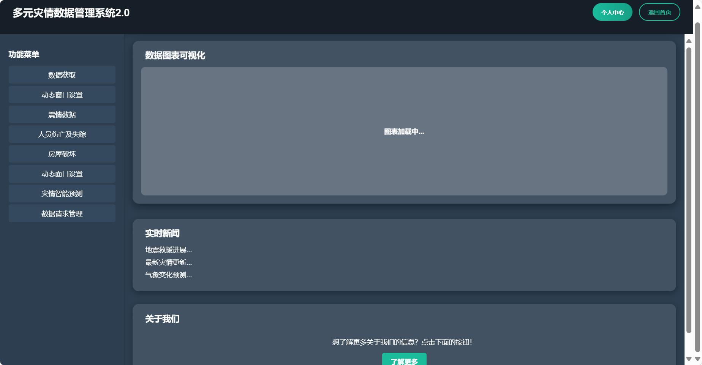

# 多元灾情数据管理系统 2.0

**多元灾情数据管理系统 2.0** 是一个基于 Vue.js 的现代化 Web 应用，旨在实现数据可视化、实时灾情信息展示以及灾情管理的智能化支持。项目采用模块化设计，界面优雅，交互友好。

---

## 📋 已完成部分

1. **项目架构设计**
   - 基于 Vue 3 框架，采用单文件组件（SFC）设计。
   - 路由功能完善，支持页面跳转与模块加载。

2. **核心功能模块**
   - **功能菜单**：提供常见灾情数据分析的功能入口。
   - **数据图表可视化**：展示数据动态加载和分析结果。
   - **实时新闻**：动态加载实时新闻信息。
   - **关于我们模块**：点击按钮跳转到“关于我们”页面。

3. **界面设计**
   - 使用 Flex 布局实现响应式页面。
   - 卡片式设计，包含悬浮效果和动画交互。
   - 整体界面风格统一，现代化设计，支持深色背景。

---

## 🔧 待完成部分

1. **数据动态加载**
   - 接入真实的后端接口，动态加载数据并更新图表。
   - 实现图表交互功能，如数据筛选和放大。

2. **多功能扩展**
   - 增加更多灾情分析模块，如地震分布图、受灾预测等。
   - 添加用户自定义功能，支持参数设置与个性化定制。

3. **页面优化**
   - 提升界面加载速度。
   - 针对移动设备的适配与优化。

4. **后端对接**
   - 实现与后端 API 的无缝对接，获取实时数据。
   - 使用 WebSocket 支持实时推送更新。

---

## 🏗️ 总体架构

### 项目结构
```
src/
├── assets/          # 静态资源（图片、图标等）
├── components/      # 组件（如功能菜单、图表区域等）
├── router/          # Vue Router 配置
├── views/           # 页面（如首页、关于我们等）
├── App.vue          # 应用主入口
├── main.js          # 主入口文件
└── store/           # Vuex 状态管理
```

### 核心技术栈
- **前端框架**：Vue 3 + Vue Router + Vuex
- **样式库**：CSS + SCSS + 自定义样式
- **图表库**：ECharts 或 Chart.js（可扩展）

---

## 🚀 项目运行方式

### 1. 环境依赖
- Node.js >= 16.0.0
- npm 或 yarn

### 2. 克隆代码
```bash
git clone https://github.com/your-repo/multi-disaster-data-system.git
cd multi-disaster-data-system
```

### 3. 安装依赖
```bash
npm install
```

### 4. 启动开发环境
```bash
npm run dev
```

### 5. 打包构建
```bash
npm run build
```


---

## 📌 注意事项
1. 确保后端 API 正常运行，并修改 `src/config.js` 中的接口地址。
2. 如果使用 HTTPS，请配置正确的 SSL 证书。

---

## 💡 项目预览

运行后可访问以下地址查看项目：
- **开发环境**：`http://localhost:3000`
- **生产环境**：`暂无`

