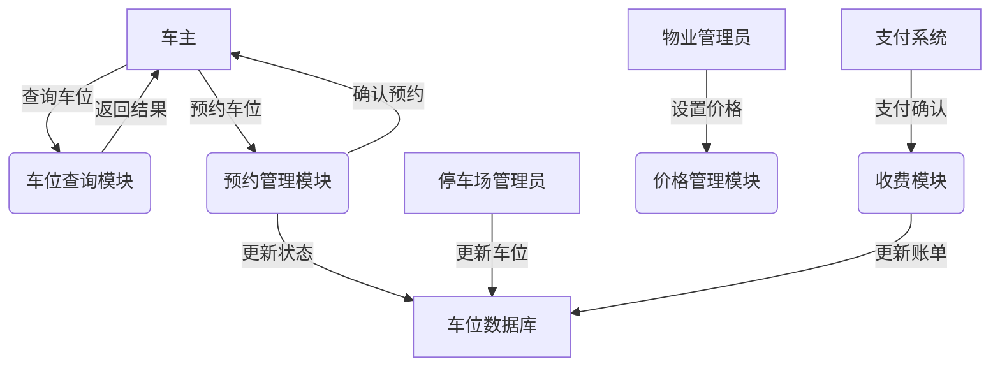
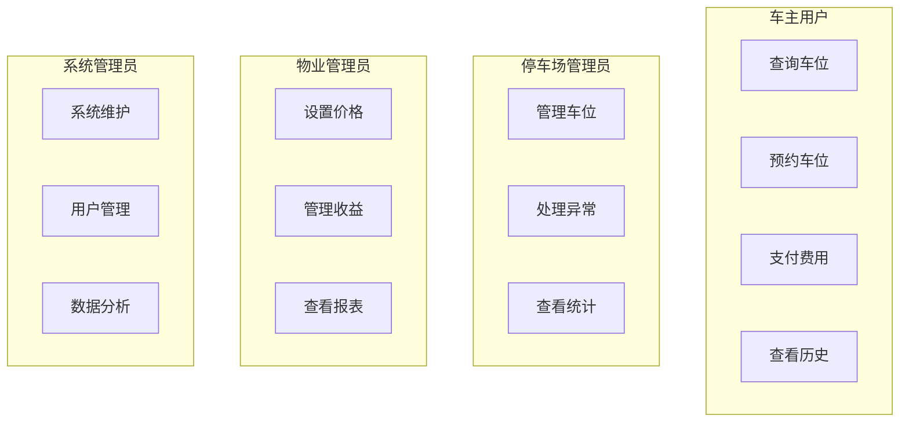

# 城市共享停车管理系统需求分析（作业二）

## 一、周境分析
### 1.1 系统边界
系统主要由四个核心子系统构成，每个子系统负责特定的功能域：

1. 用户管理子系统
   - 用户注册与认证：支持多种注册方式（手机号、邮箱），实现实名认证，确保用户身份真实性。提供多因素认证机制，包括密码、短信验证码和生物特征识别等方式。
   - 权限管理：基于RBAC（基于角色的访问控制）模型，实现细粒度的权限控制。支持角色的动态分配和权限的灵活配置。
   - 用户信息维护：提供个人信息管理功能，包括基本资料修改、车辆信息绑定、支付方式管理等。支持用户行为分析和使用记录查询。

2. 停车资源管理子系统
   - 车位信息管理：维护停车场和车位的基础信息，包括地理位置、车位尺寸、类型分类等。支持批量导入和实时更新功能。
   - 车位状态监控：通过传感器和摄像头实时监测车位占用状态，支持自动识别和人工干预。提供状态变更记录和异常情况报警。
   - 统计分析功能：收集和分析车位使用数据，生成使用率、周转率、收益等多维度报表。支持数据可视化和趋势分析。

3. 预约服务子系统
   - 在线预约处理：提供多渠道预约入口（APP、小程序、网页），支持实时预约和定时预约。实现智能推荐最优车位。
   - 状态确认管理：自动跟踪预约状态变更，包括待确认、已确认、使用中、已完成等。提供预约提醒和到期提醒服务。
   - 取消处理机制：支持灵活的取消策略，包括免费取消时间窗口、取消次数限制、信用分管理等。自动处理取消后的资源释放。

4. 支付结算子系统
   - 费用计算模块：支持多种计费模式（按时、按次、包月等），实现阶梯价格和优惠策略。提供费用预估功能。
   - 在线支付处理：集成主流支付渠道，支持实时支付和预付费模式。提供支付安全保障和交易记录查询。
   - 订单管理功能：统一管理预约和支付订单，支持订单状态跟踪、退款处理、发票开具等功能。提供订单统计和对账功能。

### 1.2 外部系统接口
1. 支付接口
   - 微信支付系统：
     * 支持扫码支付、APP支付、小程序支付等多种方式
     * 提供实时交易状态查询和退款接口
     * 支持交易通知和对账文件下载
   - 支付宝支付系统：
     * 集成APP支付、扫码支付、服务窗支付等功能
     * 提供预授权和自动扣款接口
     * 支持交易记录查询和退款处理
   - 银联支付系统：
     * 支持借记卡和信用卡支付
     * 提供快捷支付和分期付款功能
     * 实现支付安全加密和风控处理

2. 导航服务接口
   - 高德地图API：
     * 提供精确的地理编码和反地理编码服务
     * 支持周边停车场POI搜索
     * 实现路径规划和距离计算
   - 实时导航服务：
     * 提供语音导航和实时路况信息
     * 支持多路径方案推荐
     * 实现到达时间预估
   - 路径规划服务：
     * 支持多种出行方式的路线规划
     * 提供实时路况避堵功能
     * 实现途经点和车位位置的精确导航

3. 监控系统接口
   - 车位状态监测：
     * 通过地磁传感器实时检测车位占用状态
     * 支持视频分析识别车位状态
     * 提供状态变更实时推送
   - 车牌识别系统：
     * 实现高精度车牌识别和记录
     * 支持特殊车牌（新能源、军警等）识别
     * 提供车牌信息核验接口
   - 异常情况报警：
     * 检测超时停车和违规占用
     * 支持设备故障自动报警
     * 提供紧急情况处理机制

## 二、角色与权限分析
### 2.1 角色定义
1. 系统管理员
   - 职责：
     * 系统维护：负责系统运行状态监控、性能优化、故障处理等技术运维工作
     * 用户管理：管理所有用户账号，包括创建、停用、权限分配等操作
     * 数据统计：生成系统运营报表，分析系统使用情况，提供决策支持
   - 权限级别：
     * 最高级别管理权限，可以访问和操作系统所有功能
     * 可以创建和管理其他角色账号
     * 可以查看和修改系统配置参数
   - 功能范围：
     * 系统配置管理：包括基础参数设置、接口配置、安全策略等
     * 用户权限管理：分配和调整各级用户权限
     * 系统监控管理：查看系统运行状态和性能指标
     * 数据管理：数据备份、恢复、清理等操作

2. 停车场管理员
   - 职责：
     * 车位管理：维护停车场车位信息，更新车位状态
     * 收费管理：设置收费标准，处理收费异常
     * 异常处理：处理设备故障、投诉等问题
   - 权限级别：
     * 区域级别管理权限，负责特定停车场的运营管理
     * 可以管理本停车场的所有设备和车位
     * 可以处理本区域内的用户问题
   - 功能范围：
     * 车位信息管理：维护车位基础信息和状态
     * 收费标准管理：设置和调整收费规则
     * 异常情况处理：处理投诉和故障
     * 统计报表查看：分析车位使用情况

3. 物业管理员
   - 职责：
     * 小区车位管理：负责管理和维护小区内共享车位资源
     * 收益管理：跟踪和管理车位共享收益，制定分成方案
     * 投诉处理：处理业主和用户的投诉和建议
   - 权限级别：
     * 场地级别管理权限，负责特定小区的车位共享业务
     * 可以查看和管理本小区的车位资源
     * 可以设置和调整本小区的共享规则
   - 功能范围：
     * 车位共享管理：设置共享时段和规则
     * 收益统计分析：查看收益报表和分成明细
     * 业主关系维护：处理业主反馈和需求
     * 使用情况监控：监控车位使用状态和异常

4. 车主用户
   - 职责：
     * 遵守平台使用规则，按时支付费用
     * 合理使用车位，遵守停车时限
     * 及时反馈使用过程中的问题
   - 权限级别：
     * 普通用户级别，具有基本的使用权限
     * 可以查询和预约可用车位
     * 可以进行支付和评价操作
   - 功能范围：
     * 车位查询预约：搜索并预约合适的车位
     * 支付管理：费用支付和订单管理
     * 个人中心：管理个人信息和使用记录
     * 评价反馈：对使用体验进行评价

### 2.2 权限矩阵
| 功能模块 | 系统管理员 | 停车场管理员 | 物业管理员 | 车主用户 | 说明 |
|---------|------------|-------------|------------|---------|------|
| 系统配置 | ✓ | × | × | × | 包括系统参数设置、接口配置、安全策略等 |
| 用户管理 | ✓ | × | × | × | 用户账号管理、权限分配、角色设置 |
| 车位管理 | ✓ | ✓ | ✓ | × | 车位信息维护、状态更新、共享设置 |
| 价格设置 | ✓ | ✓ | ✓ | × | 停车费率设置、优惠策略配置 |
| 收益统计 | ✓ | ✓ | ✓ | × | 收入统计、分成核算、报表生成 |
| 车位查询 | ✓ | ✓ | ✓ | ✓ | 车位信息查询、可用状态查看 |
| 车位预约 | × | × | × | ✓ | 在线预约、取消、修改预约 |
| 支付操作 | × | × | × | ✓ | 费用支付、订单管理、发票申请 |

### 2.3 权限管理规则
1. 权限继承原则
   - 上级角色继承下级角色的所有权限
   - 特殊权限需要单独授权
   - 权限变更需要有审批流程

2. 权限分配规则
   - 遵循最小权限原则
   - 职责相关性原则
   - 权限互斥性原则

3. 权限变更管理
   - 变更需要有明确的申请理由
   - 重要权限变更需要多级审批
   - 所有变更需要记录日志

## 三、数据流分析
### 3.1 核心数据流图

### 3.2 主要数据流向
1. 车位信息流
   - 数据来源：
     * 停车场管理员：录入和更新基础信息
     * 物业管理员：设置共享规则和时段
     * 监控系统：实时状态更新
   - 数据去向：
     * 系统数据库：持久化存储
     * 用户查询界面：展示可用车位
     * 统计分析模块：生成使用报表
   - 数据内容：
     * 基础信息：位置、编号、类型、尺寸
     * 状态信息：空闲、占用、预约、维护
     * 共享信息：共享时段、价格、限制条件
     * 使用记录：使用时长、周转率、评价

2. 预约信息流
   - 数据来源：
     * 车主用户：发起预约请求
     * 系统自动：定时预约处理
     * 管理人员：人工干预处理
   - 数据去向：
     * 预约管理模块：状态跟踪
     * 车位数据库：更新车位状态
     * 用户界面：预约结果反馈
   - 数据内容：
     * 预约信息：时间段、车位信息、用户信息
     * 状态信息：预约状态、确认状态、使用状态
     * 车辆信息：车牌号、车型、所有人信息
     * 联系方式：手机号、紧急联系人

3. 支付信息流
   - 数据来源：
     * 车主用户：发起支付请求
     * 计费模块：生成费用账单
     * 支付系统：支付结果通知
   - 数据去向：
     * 支付系统：处理支付请求
     * 收费模块：更新支付状态
     * 统计模块：收入统计分析
   - 数据内容：
     * 支付信息：金额、方式、时间
     * 订单信息：订单号、状态、明细
     * 优惠信息：优惠券、折扣规则
     * 发票信息：开具状态、发票内容

### 3.3 用例分析图

## 四、非功能需求分析
### 4.1 性能需求
#### 4.1.1 指标设定依据
1. 并发用户量
   - 基于城市规模考虑：
     * 常规时段5万用户同时在线的设定基于中等城市的停车需求
     * 高峰时段8万并发是对早晚高峰和周末购物高峰的预估
     * 节假日峰值10万是考虑到节假日购物、旅游等场景的叠加效应
   - 操作比例关系：
     * 查询:预约:支付 = 5:2:1的比例符合用户实际使用习惯
     * 查询量大于预约量符合用户会多次查询后才决定预约的行为特征
     * 支付量最小符合部分预约可能取消的实际情况

2. 响应时间要求
   - 用户体验导向：
     * 普通查询控制在1秒内是基于用户体验最佳实践
     * 复杂筛选2秒内完成考虑到多条件组合查询的复杂度
     * 地图展示3秒内完成包含了地图渲染和标记加载时间
   - 操作响应优化：
     * 预约相关操作控制在2秒内完成保证用户操作流畅性
     * 支付流程3秒内完成考虑到与第三方支付平台的交互时间
     * 状态通知控制在2秒内完成确保用户及时获得反馈

3. 业务并发量
   - 时段分布特征：
     * 常规时段到高峰时段3倍的增长比例基于实际停车需求变化
     * 节假日峰值设为高峰时段1.5-2倍基于历史数据分析
     * 各类操作的并发量基于用户行为模式和停车场实际容量

#### 4.1.2 具体指标要求
1. 并发用户量
   - 日活跃用户要求：
     * 常规时段：支持5万+用户同时在线
     * 高峰时段：可支持8万+用户并发访问
     * 节假日峰值：预留10万+用户并发容量
   - 峰值并发用户：
     * 查询操作：支持5000+用户同时查询
     * 预约操作：支持2000+用户同时预约
     * 支付操作：支持1000+用户同时支付
   - 单停车场并发：
     * 常规车场：支持50+用户同时操作
     * 大型车场：支持100+用户同时操作
     * 商业中心：支持200+用户同时操作

2. 响应时间要求
   - 车位查询：
     * 普通查询：≤1秒
     * 复杂筛选：≤2秒
     * 地图展示：≤3秒
   - 预约操作：
     * 提交预约：≤2秒
     * 状态确认：≤1秒
     * 取消操作：≤1秒
   - 支付处理：
     * 订单生成：≤1秒
     * 支付处理：≤3秒
     * 结果通知：≤2秒

3. 业务并发量
   - 查询请求：
     * 常规时段：1000次/分钟
     * 高峰时段：3000次/分钟
     * 节假日峰值：5000次/分钟
   - 预约请求：
     * 常规时段：200次/分钟
     * 高峰时段：500次/分钟
     * 节假日峰值：1000次/分钟
   - 支付请求：
     * 常规时段：100次/分钟
     * 高峰时段：300次/分钟
     * 节假日峰值：500次/分钟

### 4.2 可用性需求
#### 4.2.1 指标设定依据
1. 系统可用性
   - 可用率标准：
     * 99.5%的年度可用率基于系统复杂度和实际运维能力
     * 月度可用率略高于年度可用率以确保稳定性
     * 核心功能99.9%的可用率保证基本服务不中断
   - 停机时间安排：
     * 计划内停机主要用于系统升级和例行维护
     * 计划外停机预留时间考虑到突发故障处理
     * 故障恢复时间基于系统备份和应急预案能力

2. 数据备份策略
   - 实时数据同步：
     * 主从实时同步确保数据安全性
     * 延迟控制在1秒内保证数据一致性
     * 强一致性要求适用于交易类关键数据
   - 历史数据维护：
     * 每日备份频率满足数据恢复需求
     * 3年保留期限符合业务和法规要求
     * 24小时恢复要求确保业务连续性

#### 4.2.2 具体指标要求
1. 系统运行时间
   - 年度可用率：99.5%
   - 月度可用率：99.6%
   - 核心功能可用率：99.9%
   - 年度停机时间：
     * 计划内停机：≤24小时
     * 计划外停机：≤12小时
     * 总计：≤36小时
   - 单次最大停机时间：
     * 常规维护：≤4小时
     * 紧急故障：≤2小时
     * 灾难恢复：≤8小时

2. 数据备份要求
   - 实时数据：
     * 实时同步：主从实时同步
     * 延迟要求：≤1秒
     * 一致性要求：强一致性
   - 历史数据：
     * 备份频率：每日一次
     * 保留时间：至少3年
     * 恢复要求：24小时内可恢复
   - 系统配置：
     * 备份频率：每周一次
     * 版本管理：保留最近10个版本
     * 恢复测试：每月进行一次

### 4.3 安全性需求
1. 用户认证
   - 多因素认证：
     * 支持密码+短信验证码
     * 支持生物特征认证
     * 支持令牌认证
   - 密码复杂度要求：
     * 最小长度：8位
     * 必须包含：大小写字母、数字、特殊字符
     * 定期更换：90天强制更换
   - 登录失败处理：
     * 连续失败5次锁定账号
     * 锁定时间：30分钟
     * 需要人工解锁或身份验证

2. 数据安全
   - 传输加密：
     * 使用SSL/TLS协议
     * 最低支持TLS 1.2
     * 定期更新加密套件
   - 存储加密：
     * 敏感数据使用AES-256加密
     * 密钥定期轮换
     * 分级存储策略
   - 敏感信息脱敏：
     * 手机号码显示中间4位
     * 身份证号显示前6后4位
     * 银行卡号显示后4位

### 4.4 可扩展性需求
1. 系统架构
   - 模块化设计：
     * 功能模块独立封装
     * 接口标准化
     * 支持模块热插拔
   - 水平扩展能力：
     * 支持集群部署
     * 负载均衡机制
     * 动态扩容能力
   - 服务解耦：
     * 微服务架构
     * 消息队列解耦
     * 数据分片存储

2. 接口兼容
   - 标准化接口：
     * RESTful API设计
     * 统一响应格式
     * 版本控制机制
   - 版本控制：
     * API版本号管理
     * 向下兼容原则
     * 废弃流程规范
   - 向下兼容：
     * 保持旧版本接口
     * 优雅降级机制
     * 渐进式更新策略

### 4.5 指标监控与优化
1. 性能监控
   - 实时监控：
     * 部署性能监控系统实时跟踪各项指标
     * 设置关键指标告警阈值
     * 建立性能分析报表体系
   - 优化机制：
     * 定期进行性能评估和优化
     * 针对性能瓶颈制定改进方案
     * 持续跟踪优化效果

2. 可用性保障
   - 监控手段：
     * 部署全链路监控系统
     * 建立健康检查机制
     * 实施故障自动告警
   - 应急预案：
     * 制定完整的故障处理流程
     * 定期进行故障演练
     * 持续优化恢复机制

3. 持续改进
   - 数据分析：
     * 收集和分析性能数据
     * 进行用户体验调研
     * 评估系统瓶颈
   - 优化方案：
     * 制定阶段性优化目标
     * 实施渐进式改进
     * 评估优化效果 