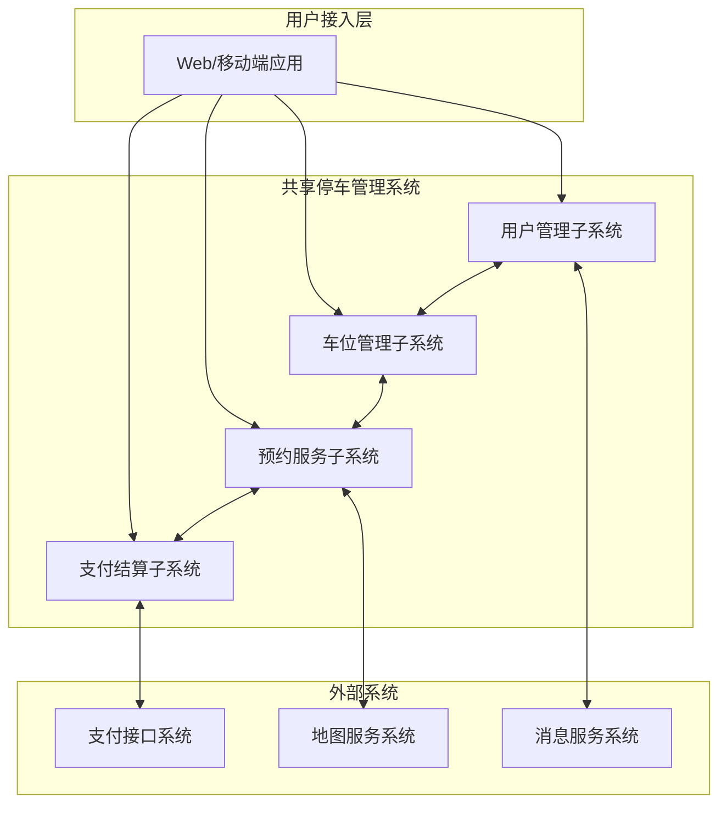
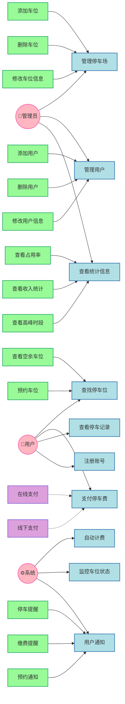
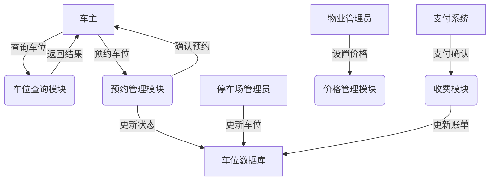

# 城市共享停车管理系统需求分析文档

## 一、周境分析
### 1.1 项目背景
随着城市机动车保有量的快速增长，停车难问题日益突出。为提高停车资源利用效率，需要建设智能化的停车管理系统。本项目旨在通过信息化手段，实现停车资源的高效管理和共享利用。

### 1.2 项目目标
构建高效、可靠的城市级共享停车管理平台，实现停车资源的智能化管理和共享利用。通过系统的实施：
1. 提升停车资源利用率
   - 实现停车位资源的共享和复用
   - 提高车位周转率
   - 减少空置浪费

2. 优化用户停车体验
   - 提供便捷的车位查询和预约服务
   - 支持多种支付方式
   - 实现智能导航和位置服务

3. 加强停车场管理效率
   - 实现停车场智能化管理
   - 提供数据分析和决策支持
   - 降低人工管理成本

### 1.3 系统范围
1. 系统类型
   - 架构：B/S架构的Web应用系统
   - 部署：云端部署，支持分布式扩展
   - 客户端：Web网页 + 移动端APP

2. 业务领域
   - 主要领域：智慧城市 - 停车管理
   - 覆盖范围：居民小区、商业中心、公共停车场
   - 业务模式：C2C（个人车位共享）、B2C（商业停车服务）

3. 用户规模
   - 目标城市：省会级特大城市
   - 停车场数量：支持1000+停车场接入
   - 车位数量：支持10万+车位管理
   - 用户规模：日活跃用户2万+

### 1.4 系统边界

1. 系统内功能
   - 用户管理子系统：负责用户注册、认证和权限管理
   - 车位管理子系统：负责车位信息维护和状态监控
   - 预约服务子系统：负责车位预约和导航服务
   - 支付结算子系统：负责费用计算和支付处理

2. 外部接口
   - 支付接口系统：提供多渠道支付服务
   - 地图服务系统：提供位置和导航服务
   - 消息服务系统：提供消息通知服务

3. 系统约束
   - 技术约束
     * 支持主流浏览器访问
     * 移动端支持Android/iOS
     * 响应时间满足性能要求
   - 业务约束
     * 符合停车场管理相关法规
     * 满足数据安全和隐私保护要求
     * 支持紧急情况处理机制
   - 资源约束
     * 硬件设施配置要求
     * 网络带宽要求
     * 存储容量要求

### 1.5 相关方分析
1. 直接相关方
   - 车主用户
     * 需求：便捷找车位、合理费用、安全保障
     * 关注点：使用便利性、费用透明度、服务可靠性
   - 停车场管理方
     * 需求：提高管理效率、增加收益、减少纠纷
     * 关注点：系统稳定性、管理便利性、数据准确性
   - 物业公司
     * 需求：规范管理、提升服务、增加收入
     * 关注点：系统可用性、收益分配、投诉处理

2. 间接相关方
   - 城市管理部门
     * 需求：缓解停车压力、规范停车秩序
     * 关注点：系统合规性、数据统计、应急处理
   - 交通管理部门
     * 需求：优化交通流量、减少违停
     * 关注点：交通疏导、秩序维护、数据共享
   - 周边商家
     * 需求：提供停车便利、吸引客流
     * 关注点：车位可用性、费用优惠、导航指引

## 二、角色与权限分析
### 2.1 角色定义
1. 系统管理员
   - 职责：
     * 系统维护：负责系统运行状态监控、性能优化、故障处理等技术运维工作
     * 用户管理：管理所有用户账号，包括创建、停用、权限分配等操作
     * 数据统计：生成系统运营报表，分析系统使用情况，提供决策支持
   - 权限级别：
     * 最高级别管理权限，可以访问和操作系统所有功能
     * 可以创建和管理其他角色账号
     * 可以查看和修改系统配置参数
   - 功能范围：
     * 系统配置管理：包括基础参数设置、接口配置、安全策略等
     * 用户权限管理：分配和调整各级用户权限
     * 系统监控管理：查看系统运行状态和性能指标
     * 数据管理：数据备份、恢复、清理等操作

2. 停车场管理员
   - 职责：
     * 车位管理：维护停车场车位信息，更新车位状态
     * 收费管理：设置收费标准，处理收费异常
     * 异常处理：处理设备故障、投诉等问题
   - 权限级别：
     * 区域级别管理权限，负责特定停车场的运营管理
     * 可以管理本停车场的所有设备和车位
     * 可以处理本区域内的用户问题
   - 功能范围：
     * 车位信息管理：维护车位基础信息和状态
     * 收费标准管理：设置和调整收费规则
     * 异常情况处理：处理投诉和故障
     * 统计报表查看：分析车位使用情况

3. 物业管理员
   - 职责：
     * 小区车位管理：负责管理和维护小区内共享车位资源
     * 收益管理：跟踪和管理车位共享收益，制定分成方案
     * 投诉处理：处理业主和用户的投诉和建议
   - 权限级别：
     * 场地级别管理权限，负责特定小区的车位共享业务
     * 可以查看和管理本小区的车位资源
     * 可以设置和调整本小区的共享规则
   - 功能范围：
     * 车位共享管理：设置共享时段和规则
     * 收益统计分析：查看收益报表和分成明细
     * 业主关系维护：处理业主反馈和需求
     * 使用情况监控：监控车位使用状态和异常

4. 车主用户
   - 职责：
     * 遵守平台使用规则，按时支付费用
     * 合理使用车位，遵守停车时限
     * 及时反馈使用过程中的问题
   - 权限级别：
     * 普通用户级别，具有基本的使用权限
     * 可以查询和预约可用车位
     * 可以进行支付和评价操作
   - 功能范围：
     * 车位查询预约：搜索并预约合适的车位
     * 支付管理：费用支付和订单管理
     * 个人中心：管理个人信息和使用记录
     * 评价反馈：对使用体验进行评价

### 2.2 权限矩阵
| 功能模块 | 系统管理员 | 停车场管理员 | 物业管理员 | 车主用户 | 说明 |
|---------|------------|-------------|------------|---------|------|
| 系统配置 | ✓ | × | × | × | 包括系统参数设置、接口配置、安全策略等 |
| 用户管理 | ✓ | × | × | × | 用户账号管理、权限分配、角色设置 |
| 车位管理 | ✓ | ✓ | ✓ | × | 车位信息维护、状态更新、共享设置 |
| 价格设置 | ✓ | ✓ | ✓ | × | 停车费率设置、优惠策略配置 |
| 收益统计 | ✓ | ✓ | ✓ | × | 收入统计、分成核算、报表生成 |
| 车位查询 | ✓ | ✓ | ✓ | ✓ | 车位信息查询、可用状态查看 |
| 车位预约 | × | × | × | ✓ | 在线预约、取消、修改预约 |
| 支付操作 | × | × | × | ✓ | 费用支付、订单管理、发票申请 |

## 三、数据流分析
### 3.1 用例分析图
基于系统的主要业务场景和用户需求，我们设计了如下用例分析图。该图展示了系统中的三类主要参与者（管理员、用户、系统）以及它们与各个用例之间的交互关系：

1. 参与者说明：
   - 管理员：包括系统管理员、停车场管理员和物业管理员，主要负责系统的管理和维护工作
   - 用户：即车主用户，系统的主要服务对象
   - 系统：代表自动化的系统功能，无需人工干预

2. 用例分类：
   - 管理类用例：包括停车场管理、用户管理等，主要面向管理员
   - 服务类用例：包括查找车位、支付费用等，主要面向普通用户
   - 自动化用例：包括自动计费、状态监控等，由系统自动执行

3. 关系说明：
   - include关系：表示被包含用例是基础用例的必要组成部分
   - extend关系：表示扩展用例是基础用例的可选功能

### 3.2 核心数据流图
基于业务流程和系统功能需求，我们设计了核心数据流图。该图展示了系统中主要数据的流转过程：

1. 设计考虑：
   - 以用户操作为起点：从车主查询车位开始，展示完整的业务流程
   - 突出核心业务：重点展示车位查询、预约、支付等核心功能
   - 清晰的数据流向：使用箭头明确标示数据流转方向和处理过程

2. 主要模块说明：
   - 查询模块：负责处理车位查询请求，返回符合条件的车位信息
   - 预约模块：处理预约申请，更新车位状态，发送确认通知
   - 价格模块：管理停车费率，支持灵活的定价策略
   - 收费模块：处理支付请求，更新账单信息

3. 数据存储：
   - 车位数据库：集中存储所有车位相关信息
   - 实时同步：确保数据的实时性和一致性
   - 状态管理：跟踪记录车位状态变化

### 3.3 主要数据流向
基于系统的业务特点和数据处理需求，我们定义了三个主要的数据流向：

1. 车位信息流
   - 数据来源：
     * 停车场管理员：负责基础信息录入和更新（基于日常管理需求）
     * 物业管理员：提供共享规则和时段设置（根据小区实际情况）
     * 监控系统：自动更新车位状态（保证数据实时性）
   - 数据去向：
     * 系统数据库：持久化存储（确保数据可靠性）
     * 用户查询界面：实时展示（提供用户服务）
     * 统计分析模块：生成报表（支持决策分析）
   - 数据内容：
     * 基础信息：位置、编号、类型、尺寸（满足识别需求）
     * 状态信息：空闲、占用、预约、维护（反映实时状态）
     * 共享信息：共享时段、价格、限制条件（支持灵活管理）
     * 使用记录：使用时长、周转率、评价（用于分析优化）

2. 预约信息流
   - 数据来源：
     * 车主用户：发起预约请求（满足停车需求）
     * 系统自动：定时预约处理（支持提前预约功能）
     * 管理人员：人工干预处理（处理特殊情况）
   - 数据去向：
     * 预约管理模块：状态跟踪（确保预约流程可控）
     * 车位数据库：更新车位状态（维护数据一致性）
     * 用户界面：预约结果反馈（提供及时响应）
   - 数据内容：
     * 预约信息：时间段、车位信息、用户信息（基本预约要素）
     * 状态信息：预约状态、确认状态、使用状态（全流程跟踪）
     * 车辆信息：车牌号、车型、所有人信息（身份验证需要）
     * 联系方式：手机号、紧急联系人（确保可联系性）

3. 支付信息流
   - 数据来源：
     * 车主用户：发起支付请求（用户主动支付）
     * 计费模块：生成费用账单（自动计费系统）
     * 支付系统：支付结果通知（第三方支付平台）
   - 数据去向：
     * 支付系统：处理支付请求（确保交易安全）
     * 收费模块：更新支付状态（维护订单状态）
     * 统计模块：收入统计分析（支持财务管理）
   - 数据内容：
     * 支付信息：金额、方式、时间（基本支付要素）
     * 订单信息：订单号、状态、明细（交易凭证）
     * 优惠信息：优惠券、折扣规则（促销方案）
     * 发票信息：开具状态、发票内容（财务需求）

## 四、非功能需求分析
### 4.1 性能需求
基于系统的实际应用场景和用户使用习惯，我们设定了以下性能指标：

1. 并发用户量
   - 日活跃用户要求：
     * 常规时段：支持2万+用户同时在线
     * 高峰时段：可支持3万+用户并发访问
     * 节假日峰值：预留5万+用户并发容量
   - 峰值并发用户：
     * 查询操作：支持2000+用户同时查询
     * 预约操作：支持1000+用户同时预约
     * 支付操作：支持500+用户同时支付

2. 响应时间要求
   - 车位查询：
     * 普通查询：≤2秒
     * 复杂筛选：≤3秒
     * 地图展示：≤5秒
   - 预约操作：
     * 提交预约：≤3秒
     * 状态确认：≤2秒
     * 取消操作：≤2秒
   - 支付处理：
     * 订单生成：≤2秒
     * 支付处理：≤5秒
     * 结果通知：≤3秒

3. 业务并发量
   - 查询请求：
     * 常规时段：500次/分钟
     * 高峰时段：1500次/分钟
     * 节假日峰值：2500次/分钟
   - 预约请求：
     * 常规时段：100次/分钟
     * 高峰时段：300次/分钟
     * 节假日峰值：500次/分钟
   - 支付请求：
     * 常规时段：50次/分钟
     * 高峰时段：150次/分钟
     * 节假日峰值：250次/分钟

### 4.2 可用性需求
基于用户体验和系统稳定性考虑，设定以下可用性指标：

1. 系统可用性
   - 系统运行时间：
     * 年度可用率：≥99.9%
     * 计划内维护：每月≤4小时
     * 故障恢复时间：≤30分钟
   - 数据备份要求：
     * 实时数据：每小时增量备份
     * 历史数据：每日全量备份
     * 备份保留：至少保留3个月

2. 用户界面
   - 操作便捷性：
     * 关键功能：≤3次点击可达
     * 界面响应：所有操作有反馈
     * 错误提示：清晰友好的提示信息
   - 界面适配：
     * 移动端：支持主流手机分辨率
     * PC端：支持常用浏览器
     * 特殊场景：支持弱网环境

3. 容错能力
   - 输入容错：
     * 数据校验：前后端双重验证
     * 异常处理：完整的异常捕获机制
     * 防重复提交：表单级防重复提交
   - 系统容错：
     * 服务降级：核心功能优先保证
     * 负载均衡：多节点动态调度
     * 熔断机制：及时隔离故障节点

### 4.3 安全性需求
从系统安全和数据保护角度，制定以下安全要求：

1. 身份认证
   - 用户认证：
     * 登录验证：支持多因素认证
     * 密码策略：强制密码复杂度要求
     * 登录保护：异常登录提醒
   - 权限控制：
     * 角色管理：基于RBAC模型
     * 操作审计：关键操作留痕
     * 会话管理：超时自动登出

2. 数据安全
   - 传输安全：
     * 通信加密：全程HTTPS加密
     * 数据加密：敏感信息加密存储
     * 完整性校验：关键数据签名验证
   - 存储安全：
     * 数据脱敏：敏感信息展示脱敏
     * 访问控制：严格的数据访问权限
     * 数据备份：异地多副本备份

3. 系统安全
   - 防攻击措施：
     * DDoS防护：部署防护设备
     * SQL注入：参数化查询
     * XSS防御：输入输出过滤
   - 安全审计：
     * 操作日志：记录关键操作
     * 访问日志：记录异常访问
     * 系统监控：实时监控告警

### 4.4 可扩展性需求
1. 系统架构
   - 模块化设计：
     * 功能模块独立封装
     * 接口标准化
     * 支持模块热插拔
   - 水平扩展：
     * 支持集群部署
     * 负载均衡机制
     * 动态扩容能力
   - 服务解耦：
     * 微服务架构
     * 消息队列解耦
     * 数据分片存储

2. 接口兼容
   - 标准化接口：
     * RESTful API设计
     * 统一响应格式
     * 版本控制机制
   - 版本控制：
     * API版本号管理
     * 向下兼容原则
     * 废弃流程规范
   - 向下兼容：
     * 保持旧版本接口
     * 优雅降级机制
     * 渐进式更新策略 