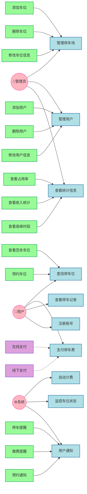

# 停车场管理系统用例分析

## 一、UML用例图

## 二、用例说明

1. 管理员用例：
   - 管理停车场：包含添加、删除、修改车位信息
   - 管理用户：包含添加、删除、修改用户信息
   - 查看统计信息：包含占用率、收入统计、高峰时段分析

2. 普通用户用例：
   - 查找停车位：包含查看空余车位、预约车位
   - 支付停车费：扩展为在线支付、线下支付
   - 查看停车记录
   - 注册账号

3. 系统用例：
   - 自动计费
   - 监控车位状态
   - 用户通知：包含停车提醒、缴费提醒、预约通知

注：
1. 箭头方向：
   - include关系：箭头从子用例指向基础用例
   - extend关系：箭头从扩展用例指向基础用例（使用虚线）
   - 参与者关系：箭头从参与者指向用例

2. 颜色说明：
   - 粉色系：参与者（浅粉色填充，粉红色边框）
   - 蓝色系：主要用例（粉蓝色填充，钢蓝色边框）
   - 绿色系：include关系用例（浅绿色填充，中绿色边框）
   - 紫色系：extend关系用例（淡紫色填充，中紫色边框）

3. 图标说明：
   - 👤：表示人类参与者
   - ⚙：表示系统参与者