# 停车场管理系统详细需求说明书

## 一、引言
### 1.1 编写目的
本文档旨在详细描述停车场管理系统的功能需求和非功能需求，为系统开发提供依据。

### 1.2 项目背景
随着机动车数量的增加，停车难问题日益突出，需要一个智能化的停车场管理系统来提高停车场的管理效率和用户体验。

### 1.3 预期读者
- 项目开发团队
- 项目测试团队
- 项目管理人员
- 用户代表

## 二、系统概述
### 2.1 系统目标
开发一个现代化的停车场管理系统，实现停车场的智能化管理，提高停车效率，改善用户体验。

### 2.2 系统范围
系统包括停车场管理、用户管理、计费管理、统计分析等功能模块。

## 三、用例分析
### 3.1 系统用例图

```mermaid
graph TB
    %% 定义参与者
    admin(("👤管理员"))
    user(("👤用户"))
    sys(("⚙系统"))

    %% 定义主要用例
    uc1["管理停车场"]
    uc2["管理用户"]
    uc3["查看统计信息"]
    uc4["查找停车位"]
    uc5["支付停车费"]
    uc6["查看停车记录"]
    uc7["注册账号"]
    uc8["自动计费"]
    uc9["监控车位状态"]
    uc10["用户通知"]

    %% 定义子用例
    uc1_1["添加车位"]
    uc1_2["删除车位"]
    uc1_3["修改车位信息"]
    uc2_1["添加用户"]
    uc2_2["删除用户"]
    uc2_3["修改用户信息"]
    uc3_1["查看占用率"]
    uc3_2["查看收入统计"]
    uc3_3["查看高峰时段"]
    uc4_1["查看空余车位"]
    uc4_2["预约车位"]
    uc5_1["在线支付"]
    uc5_2["线下支付"]
    uc10_1["停车提醒"]
    uc10_2["缴费提醒"]
    uc10_3["预约通知"]

    %% 定义关系
    admin --> uc1
    admin --> uc2
    admin --> uc3
    
    user --> uc4
    user --> uc5
    user --> uc6
    user --> uc7
    
    sys --> uc8
    sys --> uc9
    sys --> uc10

    %% include关系（箭头指向被包含用例）
    uc1_1 --> uc1
    uc1_2 --> uc1
    uc1_3 --> uc1
    
    uc2_1 --> uc2
    uc2_2 --> uc2
    uc2_3 --> uc2
    
    uc3_1 --> uc3
    uc3_2 --> uc3
    uc3_3 --> uc3
    
    uc4_1 --> uc4
    uc4_2 --> uc4
    
    %% extend关系（箭头指向基础用例）
    uc5_1 -.-> uc5
    uc5_2 -.-> uc5
    
    uc10_1 --> uc10
    uc10_2 --> uc10
    uc10_3 --> uc10

    %% 样式
    classDef actor fill:#FFB6C1,stroke:#FF69B4,stroke-width:2px
    classDef usecase fill:#B0E0E6,stroke:#4682B4,stroke-width:2px
    classDef include fill:#98FB98,stroke:#3CB371,stroke-width:2px
    classDef extend fill:#DDA0DD,stroke:#9370DB,stroke-width:2px

    class admin,user,sys actor
    class uc1,uc2,uc3,uc4,uc5,uc6,uc7,uc8,uc9,uc10 usecase
    class uc1_1,uc1_2,uc1_3,uc2_1,uc2_2,uc2_3,uc3_1,uc3_2,uc3_3,uc4_1,uc4_2,uc10_1,uc10_2,uc10_3 include
    class uc5_1,uc5_2 extend
```

### 3.2 用例说明

#### 3.2.1 管理员用例
1. 管理停车场
   - 功能描述：管理停车场的车位信息
   - 包含用例：
     * 添加车位：新增停车位
     * 删除车位：移除停车位
     * 修改车位信息：更新车位状态和信息

2. 管理用户
   - 功能描述：管理系统用户信息
   - 包含用例：
     * 添加用户：新增用户账号
     * 删除用户：移除用户账号
     * 修改用户信息：更新用户资料

3. 查看统计信息
   - 功能描述：查看停车场运营数据
   - 包含用例：
     * 查看占用率：实时车位使用情况
     * 查看收入统计：停车费用统计
     * 查看高峰时段：停车高峰期分析

#### 3.2.2 普通用户用例
1. 查找停车位
   - 功能描述：查询和预约停车位
   - 包含用例：
     * 查看空余车位：查询可用车位
     * 预约车位：提前预定车位

2. 支付停车费
   - 功能描述：缴纳停车费用
   - 扩展用例：
     * 在线支付：通过移动支付缴费
     * 线下支付：通过现金或刷卡缴费

3. 查看停车记录
   - 功能描述：查询历史停车信息

4. 注册账号
   - 功能描述：创建新用户账号

#### 3.2.3 系统用例
1. 自动计费
   - 功能描述：根据停车时长自动计算费用

2. 监控车位状态
   - 功能描述：实时监测车位占用情况

3. 用户通知
   - 功能描述：向用户推送相关信息
   - 包含用例：
     * 停车提醒：提醒停车位置和时间
     * 缴费提醒：提醒缴纳停车费
     * 预约通知：通知预约成功或取消

## 四、功能需求
[后续内容...] 