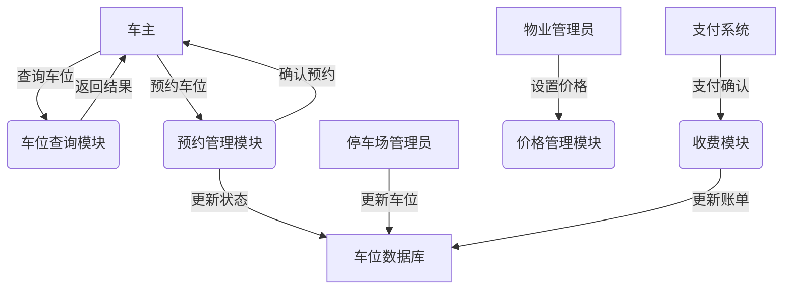
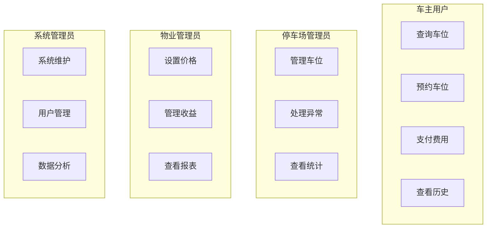

# 城市共享停车管理系统需求分析文档

## 一、项目概述
### 1.1 项目背景
某公司期望开发一套"城市共享停车管理系统"，目的是解决停车难，车位空忙不均等情况，推动单位大院、居民区等开放空车位。

### 1.2 项目目标
1. 提高停车位利用率
2. 减少寻找停车位的时间成本
3. 实现停车资源的共享经济
4. 缓解城市停车压力

## 二、周境分析（作业二-1）
### 2.1 系统边界
```
需求条款101 = 模板34
<系统> = 城市共享停车管理系统
<功能> = 管理
<对象> = 停车资源
<性能> = 实时
<单位> = 分钟

对应的自然语言描述：
城市共享停车管理系统应当实时管理停车资源。
```

#### 2.1.1 系统范围
1. 停车资源管理子系统
   - 车位信息管理
   - 车位状态监控
   - 车位预约处理

2. 用户服务子系统
   - 用户注册登录
   - 车位查询预约
   - 支付管理

3. 导航对接子系统
   - 位置服务
   - 路线规划
   - 实时导航

### 2.2 外部系统接口
1. 支付接口
   - 微信支付
   - 支付宝
   - 银联支付

2. 地图导航接口
   - 高德地图API
   - 位置服务API
   - 路线规划API

3. 监控系统接口
   - 车位状态监测
   - 车牌识别
   - 异常情况报警

## 三、角色与权限分析（作业二-2）
### 3.1 角色定义
```
需求条款102 = 模板34
<系统> = 城市共享停车管理系统
<功能> = 支持
<对象> = 多角色管理
<性能> = 4类
<单位> = 角色

对应的自然语言描述：
城市共享停车管理系统应当支持4类角色的管理。
```

1. 系统管理员
   - 职责：系统维护、用户管理、数据统计
   - 权限级别：最高

2. 停车场管理员
   - 职责：车位管理、收费管理、异常处理
   - 权限级别：区域级

3. 物业管理员
   - 职责：小区车位管理、收益管理
   - 权限级别：场地级

4. 车主用户
   - 职责：车位查询、预约、支付
   - 权限级别：普通用户

### 3.2 权限矩阵
| 功能模块 | 系统管理员 | 停车场管理员 | 物业管理员 | 车主用户 |
|---------|------------|-------------|------------|---------|
| 系统配置 | ✓ | × | × | × |
| 用户管理 | ✓ | × | × | × |
| 车位管理 | ✓ | ✓ | ✓ | × |
| 价格设置 | ✓ | ✓ | ✓ | × |
| 收益统计 | ✓ | ✓ | ✓ | × |
| 车位查询 | ✓ | ✓ | ✓ | ✓ |
| 车位预约 | × | × | × | ✓ |
| 支付操作 | × | × | × | ✓ |

## 四、数据流分析（作业二-3）
### 4.1 数据流图


### 4.2 用例分析图


### 4.3 主要数据流向
1. 车位信息流
   - 来源：停车场管理员、物业管理员
   - 去向：系统数据库、用户查询界面
   - 内容：位置、状态、价格、使用情况

2. 预约信息流
   - 来源：车主用户
   - 去向：预约管理模块、车位数据库
   - 内容：预约时间、车位信息、用户信息

3. 支付信息流
   - 来源：车主用户
   - 去向：支付系统、收费模块
   - 内容：支付金额、支付方式、订单信息

## 五、非功能需求分析（作业二-4）
### 5.1 性能需求
```
需求条款103 = 模板34
<系统> = 城市共享停车管理系统
<功能> = 处理
<对象> = 并发请求
<性能> = 1万
<单位> = 次/秒

对应的自然语言描述：
城市共享停车管理系统应当能够处理1万次/秒的并发请求。
```

1. 并发用户量
   - 日活跃用户：10万+
   - 峰值并发用户：1万+
   - 单停车场并发预约：100+

2. 响应时间要求
   - 车位查询：≤2秒
   - 预约操作：≤3秒
   - 支付处理：≤5秒

3. 业务并发量
   - 查询请求：5000次/分钟
   - 预约请求：1000次/分钟
   - 支付请求：500次/分钟

### 5.2 可用性需求
1. 系统运行时间
   - 系统可用性：99.9%
   - 年度停机时间：≤8.76小时
   - 单次最大停机时间：≤30分钟

2. 数据备份要求
   - 实时数据：实时备份
   - 历史数据：每日备份
   - 系统配置：每周备份

### 5.3 安全性需求
1. 用户认证
   - 多因素认证
   - 密码复杂度要求
   - 登录失败处理

2. 数据安全
   - 传输加密：SSL/TLS
   - 存储加密：AES-256
   - 敏感信息脱敏

### 5.4 可扩展性需求
1. 系统架构
   - 模块化设计
   - 水平扩展能力
   - 服务解耦

2. 接口兼容
   - 标准化接口
   - 版本控制
   - 向下兼容

### 5.5 维护性需求
1. 系统监控
   - 性能监控
   - 错误日志
   - 用户行为分析

2. 系统维护
   - 在线更新
   - 热备切换
   - 故障自动恢复 