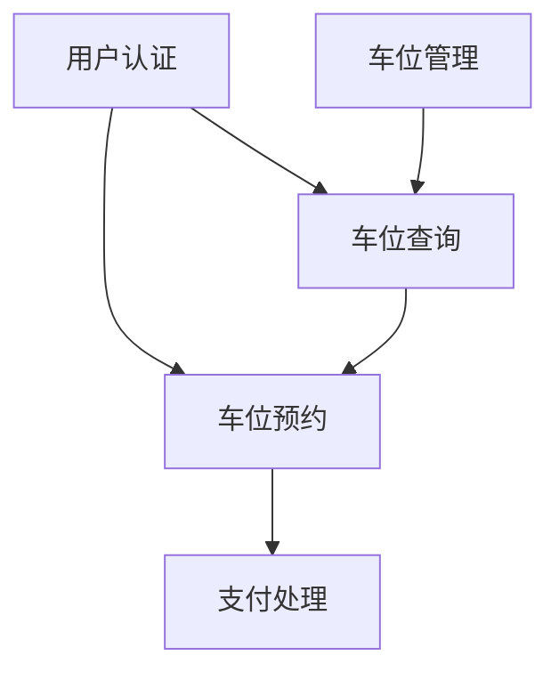
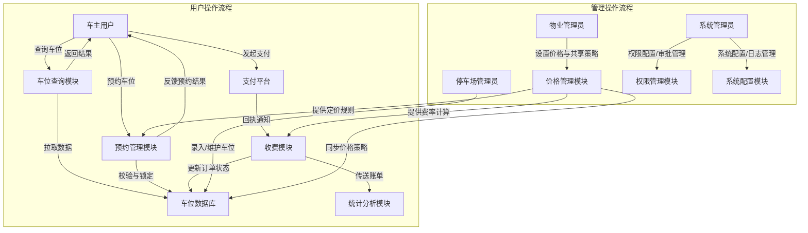

# 城市共享停车管理系统需求规格说明书

## 一、引言

### 1.1 编写目的
本文档旨在为"城市共享停车管理系统"的开发提供明确、系统的需求依据。通过界定系统目标、核心功能与性能要求，为设计、实现、测试和后期运维等环节提供一致的参考标准，从而提高项目效率与交付质量，确保系统建设能有效解决城市停车资源分配不均的问题。

### 1.2 项目背景
随着城市机动车数量的持续增长，城市停车难问题日益突出。特别是在核心商圈、学校、交通枢纽等区域，停车需求集中、资源紧张，车主往往需要长时间寻找可用车位，既浪费时间，又加剧交通拥堵。与此同时，城市中仍存在大量因封闭管理、时段空置而未被充分利用的停车资源，如机关单位、居民小区、企业园区等的内部车位。

"共享"模式的兴起为优化城市停车结构提供了新思路。通过技术手段打通车位供需两端，将原本封闭、低效利用的停车资源开放出来，能够在不额外建设新泊位的前提下，提升整体资源使用率，缓解结构性供需错位。

基于此背景，本项目计划构建一个具备实时车位信息发布、预约调度、导航引导与智能计费等功能的一体化平台，连接车主与车位管理者，实现城市停车资源的智能化匹配与共享使用。

### 1.3 参考标准
系统的开发与运行将参考以下规范与行业实践：

- 《智能停车场信息系统建设导则》
- 《信息安全技术 网络安全等级保护基本要求（GB/T 22239）》
- 《高德地图API文档》及相关位置服务接口规范
- 主流支付平台（如微信/支付宝）接入协议

## 二、项目概述

### 2.1 项目目标
本系统的建设目标，是通过构建一个智能化的共享停车服务平台，缓解城市核心区域"停车难"的问题，并激活社会中大量尚未充分利用的停车资源。

系统将以用户便捷为核心设计导向，围绕车位的实时可视化、快速预约、精准导航与自动计费等关键环节，建立起完整的服务闭环。用户可通过移动应用快速查看附近可用车位，并在几步之内完成预订与导航，从而显著缩短寻找车位的时间。而对于车位提供方，系统则提供灵活的共享时段配置和收益管理功能，使得原本封闭的泊位资源可以在安全、有序的机制下实现价值转化。

平台还预留了丰富的扩展接口，未来可对接城市级交通平台、支付渠道、导航服务商及智能硬件系统，具备进一步支撑城市级资源调度与精细化治理的能力。整体架构将力求平衡"快速部署"与"长期演进"的双重需求，使项目既能快速落地，又具备可持续发展空间。

### 2.2 服务对象与应用场景
系统服务对象主要包括三类：普通城市车主、停车资源提供方，以及平台运营与管理机构。

对车主而言，系统的价值在于提升找车位的效率与使用体验，尤其是在出行高峰或陌生区域，快速获取空车位信息并顺利停车，能够显著降低出行焦虑。而对于提供车位的一方，如小区物业、企业单位或学校机构，他们希望能在保障本地秩序的前提下，实现车位的收益化与智能管理。

此外，平台还将服务于城市管理者与运营机构，帮助他们实现对停车资源的集中掌控、调度与优化。通过汇聚城市中碎片化的泊位信息并统一标准输出，系统有望逐步成为智能交通基础设施的一部分，为未来的出行政策与治理提供数据支撑。

系统将优先覆盖居民小区、商业中心、学校园区、政务机关及轨道交通口等高频应用区域，支持多种共享模式（如夜间开放、节假日临停等），以适配不同用户群的实际需求。

### 2.3 技术架构与系统特性
平台将采用云原生架构和前后端分离模式，确保系统具有良好的可扩展性与高可用性，能够支持百万级别的用户同时使用而保持响应稳定。

技术上，系统会搭建一个统一的数据中心，实时接入并管理车位状态、用户行为、交易记录等核心信息，为业务调度与策略优化提供支撑。同时，平台将设计开放的API接口，兼容地图导航、支付服务、智能摄像头等外部组件，方便未来与其他系统集成。

考虑到城市级部署的复杂性，系统会从架构层面引入容灾机制，包括消息中间件、故障隔离、热备份等手段，保障关键业务在不同场景下均能稳定运行。此外，为应对可能的并发高峰，平台会部署弹性扩展能力，根据访问负载进行自动调整，从而提升整体服务的鲁棒性。

## 三、项目环境

### 3.1 软件环境
本系统将在多平台协同的基础上完成开发与部署，整体采用主流、稳定的技术栈以保障系统的可维护性与扩展能力。

在开发阶段，团队将基于 Windows 或 Linux 操作系统展开工作，使用 IntelliJ IDEA / VS Code 等集成开发环境进行前后端协作开发。版本控制采用 Git，并结合 CI/CD 工具链实现自动构建与部署流程，提升交付效率。

后端服务将主要采用 Java 语言构建，辅以前端 JavaScript（React / Vue 等框架）进行界面开发。整体系统遵循前后端分离架构，配合 RESTful 接口进行通信。

运行时环境将部署在 Linux 服务器上，数据库采用 MySQL，以兼顾数据一致性、事务处理与运维便捷性。缓存中间件选用 Redis，用于提升热点数据访问效率。为支持用户高并发请求与异步消息处理，系统将集成 Kafka 消息队列，构建稳定可靠的事件驱动架构，为后续智能调度、行为分析等模块提供基础支撑。

### 3.2 硬件环境
在实际部署层面，系统将面向城市级别用户规模进行基础资源配置，确保平台运行稳定性与可扩展性。

应用服务器将采用 16 核 CPU 与 32GB 内存配置，支撑前端访问请求处理、接口调用与服务集成等任务；数据库服务器配置更高，预设为 16 核 CPU、64GB 内存，以应对频繁读写、事务处理与数据分析请求。初期部署阶段预留 10TB 的存储空间，用于车位信息、用户行为日志及支付记录的长期存储。

网络环境方面，内网通过千兆以太网进行高速连接，保障各服务节点间的数据交互效率；同时系统外网出口带宽不低于 100Mbps，以满足用户高峰时段的访问请求，避免服务响应瓶颈。

整个基础设施具备良好的弹性调整能力，后续可根据用户增长与业务扩展逐步进行横向扩容，保障平台持续可用与性能冗余。

## 四、功能需求

### 4.1 系统功能结构
本系统由用户管理、车位管理、预约服务和支付结算四大子系统构成。这些子系统紧密配合，共同支撑城市共享停车的完整业务流程，满足用户多样化需求，并保证平台的高效运营和持续发展。

### 4.2 用户管理子系统
用户管理是平台的基础模块，承担用户身份识别与权限保障的核心任务。系统支持手机号、邮箱、第三方社交账号（如微信、支付宝）的多种注册方式，降低用户注册门槛，方便快速接入。注册过程中，平台引入实名认证流程，确保用户身份真实有效，提升系统整体安全性。

为了保障账户安全，平台实现多因素认证机制，结合短信验证码、动态口令或设备指纹识别，防止账号被恶意盗用。用户注册后，可在个人中心维护个人信息，包括联系方式、绑定车辆信息及偏好设置等，支持用户灵活修改和完善资料。

权限管理基于角色的访问控制（RBAC）模型，将用户分为普通车主、车位管理员及平台运营人员等不同角色。系统对各角色赋予相应操作权限，保证不同身份用户只能访问和操作与其职责相关的功能模块，防止越权操作，保障系统安全稳定。

此外，用户管理模块还支持账号注销、密码找回及异常登录提醒等功能，增强用户体验和安全保障。历史操作日志的记录便于审计和问题排查。

### 4.3 车位管理子系统
车位管理是平台连接供给方和需求方的核心模块，负责车位资源的维护、状态监控与运营分析。首先，系统支持停车场及车位基础信息的录入与维护，内容包括车位编号、所属停车场、地理位置、车位类型（如普通车位、残疾人车位、电动车位）、使用规则及开放时间等。为了方便大规模接入，平台提供批量导入工具，支持Excel或CSV格式数据快速上传。

车位状态的实时监控依赖于安装的智能传感器、摄像头及物联网设备。这些设备可精准检测车位的占用情况，实时将信息反馈至平台。系统通过大数据分析及规则引擎，识别异常停车行为，如超时停留、未预约占用等，并即时触发报警通知车位管理员，提升管理效率与服务质量。

运营分析方面，车位管理子系统会持续收集使用数据，包括车位利用率、平均停车时长、空闲时间分布及收入统计。平台可根据数据生成多维度报表，辅助管理方制定调度策略、优化车位共享方案，提高整体资源利用效率。

此外，车位管理模块支持灵活配置车位开放规则，如夜间共享、节假日限时开放、优先预约规则等，满足不同停车场和区域的个性化需求。

### 4.4 预约服务子系统
预约服务是车主与车位之间的桥梁，核心目标是实现车位资源的高效分配和保障用户停车需求。平台支持通过移动应用、小程序及网页端等多渠道提供预约服务，确保用户能方便快捷地查询和预订车位。

用户可根据位置、价格、车位类型及停车时长等条件筛选车位，并选择实时可用或未来时段预约。系统结合历史使用数据和当前实时状态，智能推荐最优车位，提升预约成功率和用户满意度。

预约状态的管理贯穿整个停车流程。系统自动跟踪预约确认、变更及取消，实时向用户推送提醒信息，包括预约成功通知、到期提醒及异常情况预警。取消机制支持灵活操作，允许用户在规定时间内无障碍取消，同时设有防止恶意频繁取消的规则，保障车位资源的合理利用。

此外，平台引入智能调度算法，根据用户需求及车位实时状态优化分配方案，动态调整车位供应，最大限度地提升资源利用率和服务响应速度。

### 4.5 支付结算子系统
支付结算模块承担平台收费及资金管理的关键职责。平台支持多种计费策略，包括按时计费、阶梯定价和优惠券折扣等，满足不同停车场和时间段的多样化需求。管理方可根据实际运营状况灵活调整收费规则，实现收益最大化与用户体验平衡。

系统集成了支付宝、微信支付等主流第三方支付渠道，确保支付过程的安全性与顺畅性。通过采用支付加密技术及风控策略，保障用户资金安全和交易数据隐私，有效防范欺诈和支付风险。

订单管理模块统一管理所有支付交易，记录支付状态、金额、时间及订单详情。系统支持退款处理及发票开具，满足用户和运营方的财务需求。后台还提供财务数据统计、账务核算及报表生成工具，方便运营人员进行资金监控和风险管理。

通过完整的支付闭环设计，平台实现从计费、支付到结算的全流程自动化和规范化，保障业务稳定可靠运行。

### 4.6 数据需求

#### 4.6.1 数据实体设计
系统的数据结构设计围绕业务流程和核心对象展开，确保信息的完整性和一致性。主要数据实体包括：

用户信息：包含用户的唯一标识（用户ID）、姓名、联系方式（手机号、邮箱等）、账户状态以及实名认证信息等。用户数据不仅用于身份验证，还支持个性化服务，如车辆信息绑定和偏好设置。

停车场信息：记录各停车场的唯一标识（停车场ID）、地理位置信息（经纬度及详细地址）、停车场类型（如商业停车场、居民小区停车场）、管理方信息及开放时间规则。停车场数据是车位管理与导航服务的基础。

车位信息：涵盖每个车位的唯一标识（车位ID）、所属停车场、具体地理位置、车位类型（普通、残疾人、电动车等）、当前状态（空闲、占用、预约中等）、智能设备关联信息以及使用规则。实时状态更新是车位调度和预约管理的重要依据。

预约记录：详细记录每笔预约的信息，包括预约ID、关联的用户ID、车位ID、预约起止时间、预约状态（已预约、已取消、已完成等）、以及预约渠道和来源。该数据支持预约流程管理及统计分析。

支付记录：反映支付流水信息，包括支付ID、关联预约ID、支付金额、支付时间、支付状态（成功、失败、退款）、支付方式及相关交易凭证。支付数据是财务结算和订单管理的关键基础。

#### 4.6.2 数据关系设计
各数据实体间建立合理关系，确保业务流程顺畅并便于数据查询和统计：

用户与预约的关系为一对多，一个用户可以有多条预约记录，反映用户多次停车预约的业务场景。

停车场与车位的关系为一对多，每个停车场包含多个车位，体现停车资源的层级结构。

车位与预约的关系也是一对多，一个车位在不同时间段可能对应多条预约记录，支持时序性管理和预约冲突检测。

预约与支付的关系为一对一，每笔预约对应唯一一笔支付记录，确保账务与停车服务的准确对接。

合理的数据设计不仅保障了系统功能的实现，也为后续的数据统计、业务分析和扩展提供了坚实基础。

## 五、非功能需求

### 5.1 性能需求
系统的性能直接影响用户体验和停车资源的利用效率，需要在实时性、准确性和业务处理方面达到严格的标准：

#### 5.1.1 并发用户量
1. 日活跃用户要求：
   - 常规时段：支持2万+用户同时在线
   - 高峰时段：可支持3万+用户并发访问
   - 节假日峰值：预留5万+用户并发容量

2. 峰值并发用户：
   - 查询操作：支持2000+用户同时查询
   - 预约操作：支持1000+用户同时预约
   - 支付操作：支持500+用户同时支付

3. 单停车场并发：
   - 常规车场：支持20+用户同时操作
   - 大型车场：支持50+用户同时操作
   - 商业中心：支持100+用户同时操作

说明：共享停车平台面向大量用户，尤其在工作日高峰期和节假日，用户访问量显著增长。系统必须具备足够的并发承载能力，保障用户能顺畅完成查询、预约及支付等操作，避免因系统拥堵导致响应延迟或失败。单停车场并发指标反映了在局部热点区域的访问压力，确保局部热点不会成为整体性能瓶颈。充足的并发支持是提升用户体验和维护平台商业价值的基础。

#### 5.1.2 响应时间要求
1. 车位查询：
   - 普通查询：≤2秒
   - 复杂筛选：≤3秒
   - 地图展示：≤5秒

2. 预约操作：
   - 提交预约：≤3秒
   - 状态确认：≤2秒
   - 取消操作：≤2秒

3. 支付处理：
   - 订单生成：≤2秒
   - 支付处理：≤5秒
   - 结果通知：≤3秒

说明：停车服务与用户出行紧密相关，快速响应是保障用户操作体验的关键。长时间等待会降低用户满意度，甚至导致用户流失。尤其支付环节的延迟可能直接影响交易完成率，损害平台收益。明确响应时间指标，有助于指导系统架构设计和性能优化，确保业务流程流畅且用户体验优质。

#### 5.1.3 业务并发量
1. 查询请求：
   - 常规时段：500次/分钟
   - 高峰时段：1500次/分钟
   - 节假日峰值：2500次/分钟

2. 预约请求：
   - 常规时段：100次/分钟
   - 高峰时段：300次/分钟
   - 节假日峰值：500次/分钟

3. 支付请求：
   - 常规时段：50次/分钟
   - 高峰时段：150次/分钟
   - 节假日峰值：250次/分钟

说明：不同业务请求的并发量需求体现了用户使用习惯及业务流程特征。合理预估各类请求的并发峰值，有助于科学配置系统资源，避免出现单点瓶颈，保证系统在业务高峰时段也能稳定响应，确保整体系统的可靠性与扩展性。

### 5.2 可用性需求
为保障用户随时访问服务的稳定性和数据的完整性，系统必须满足高可用性和数据安全要求：

#### 5.2.1 系统运行时间
1. 年度可用率：≥99.9%
2. 计划内维护：每月≤4小时
3. 故障恢复时间：≤30分钟

说明：共享停车服务涉及用户的实际出行需求，系统的高可用性直接影响用户信任和平台的商业运营。99.9%的可用率保证了服务全年大部分时间可用，较短的计划维护窗口和快速故障恢复时间减少系统中断带来的负面影响，有效支撑用户的及时停车需求和业务连续性。

#### 5.2.2 数据备份要求
1. 实时数据：每小时增量备份
2. 历史数据：每日全量备份
3. 备份保留：至少保留3个月

说明：数据备份策略是确保用户数据安全、业务连续和应对突发事件的关键措施。实时备份保障最新数据安全，历史备份则支持数据追溯和恢复操作。备份保留期限符合业务合规及用户权益保护要求，降低因数据丢失导致的法律和信誉风险。

#### 5.2.3 容错能力
1. 输入容错：
   - 数据校验：前后端双重验证
   - 异常处理：完善的异常捕获机制
   - 防重复提交：表单级防重复提交

2. 系统容错：
   - 服务降级：保证核心功能优先可用
   - 负载均衡：多节点动态调度请求
   - 熔断机制：及时隔离故障节点

说明：用户输入错误和系统异常是常见的运营风险，系统需要具备强大的容错能力保障业务的连续性。双重校验和异常捕获减少人为和技术失误引发的系统错误。服务降级和负载均衡策略能在部分服务异常时保证关键业务正常运行，熔断机制防止故障扩散，提升系统整体稳定性。

### 5.3 安全性需求
为了保护用户隐私和资金安全，系统必须具备完善的身份认证和数据安全措施：

#### 5.3.1 身份认证
1. 用户认证：
   - 登录验证支持多因素认证，增强账户安全
   - 密码策略强制密码复杂度，降低密码破解风险
   - 异常登录提醒保障用户账户异常访问及时发现

2. 权限控制：
   - 基于RBAC的角色管理，细化权限分配
   - 操作审计记录关键操作，保障安全审查和追责
   - 会话管理实现自动超时登出，防止会话被盗用

说明：强化身份认证和权限控制是防范非法访问和数据泄露的核心措施。多因素认证和密码策略减少账户被攻击风险，异常提醒及时发现安全威胁。基于角色的权限管理和操作审计增强系统的管理透明度和安全可控性，有效防止内部和外部安全风险。

#### 5.3.2 数据安全
1. 传输安全：
   - 全程HTTPS加密保障通信安全
   - 敏感信息加密存储保护数据隐私
   - 关键数据签名校验确保数据完整性

2. 存储安全：
   - 敏感信息脱敏处理防止信息泄露
   - 严格访问控制限制数据访问范围
   - 异地多副本备份提升数据灾备能力

说明：数据在传输和存储过程中的安全保护是用户隐私和交易安全的基础。通信加密防止数据被窃取，存储加密和脱敏减少泄露风险，访问控制确保数据仅被授权用户使用。多副本备份保障数据在灾难情况下的恢复能力，保障业务连续运行。

### 5.4 可扩展性需求
系统设计需预留充分扩展能力，以适应未来业务增长和技术演进：

#### 5.4.1 系统架构
1. 模块化设计：
   - 功能模块独立封装，便于维护和升级
   - 标准化接口设计支持模块间的灵活交互
   - 支持模块热插拔，提升系统灵活性

2. 水平扩展：
   - 支持集群部署和负载均衡
   - 动态扩容能力适应业务增长
   - 多节点协同提升系统整体性能

3. 服务解耦：
   - 微服务架构降低系统耦合度
   - 消息队列实现服务间异步通信
   - 数据分片存储支持大规模数据管理

说明：随着用户数量和业务复杂度提升，系统必须支持平滑扩展，避免因单点瓶颈影响整体性能。模块化和微服务架构降低系统耦合度，提升开发效率和运维灵活性。集群部署和负载均衡保障系统高可用和高性能，分布式存储支撑大数据量和高并发访问需求。

#### 5.4.2 接口兼容
1. 标准化接口：
   - RESTful API设计规范接口交互
   - 统一响应格式便于系统集成
   - 版本控制机制支持平滑升级

2. 版本控制：
   - API版本号管理确保兼容性
   - 向下兼容原则保护现有用户
   - 废弃流程规范避免接口混乱

说明：标准化和兼容性良好的接口设计，是系统与外部平台、客户端及第三方服务顺利协同的前提。合理的版本管理避免接口变更对现有用户和业务的影响，规范的废弃流程保障系统的长期可维护性，提升整体生态的健康度。

## 六、系统接口

### 6.1 用户界面
系统的用户界面设计注重简洁现代，力求为用户提供清晰直观的操作体验。界面采用响应式设计，能够适配各种终端设备，包括桌面浏览器、平板和手机，确保用户无论何时何地都能顺畅使用系统。为了提升系统的兼容性，界面支持主流浏览器，如Chrome、Firefox、Edge和Safari，并符合无障碍设计标准，保障视觉障碍等特殊用户的访问需求。通过这些设计，系统不仅满足不同用户群体的使用习惯，还极大提高了整体的易用性和访问便捷性。

### 6.2 外部接口
系统与多个第三方平台进行紧密集成，保障核心功能的稳定和高效运行。支付接口支持微信支付、支付宝和银联支付三大主流渠道，覆盖绝大多数用户的支付需求，确保支付过程安全、快速且体验流畅。除此之外，系统依托高德地图API实现地图服务，包括精准的地理定位、路径导航和实时位置更新，为用户提供全面的停车场位置查询和导航指引。这些外部接口的集成不仅增强了系统的功能完整性，也提升了用户在使用过程中的便利性和满意度。

## 七、用例分析

### 7.1 业务流程与用例分析
系统的核心业务涵盖停车位的管理与用户的预约服务。停车位管理流程包括录入车位信息、实时状态监控、状态更新及数据统计，确保车位信息准确且动态反映当前状态，为后续预约服务提供坚实基础。车主用户可通过车位查询、选择和预约，完成车位的预订及支付流程，保障使用体验的顺畅和高效。此外，管理人员负责车位状态的维护和更新，确保资源合理分配和系统稳定运行。

关键用例如下：

| 用例名称 | 主要参与者 | 前置条件 | 后置条件 |
|----------|------------|----------|-----------|
| 车位查询 | 车主用户 | 用户已登录 | 展示可用车位 |
| 车位预约 | 车主用户 | 存在空闲车位 | 预约成功并扣费 |
| 状态更新 | 管理人员 | 系统正常运行 | 车位状态已更新 |

对应业务流程如下：

停车位录入与状态监控流程


关联用例：状态更新

车位查询流程


关联用例：车位查询

车位预约流程


关联用例：车位预约

### 7.2 需求跟踪与分析

#### 7.2.1 需求依赖分析
系统各需求之间存在一定的依赖关系。用户认证是所有用户操作的基础，确保用户身份合法后方可进行车位查询与预约；车位预约依赖查询结果，并与支付处理紧密关联；车位管理则保障车位信息与状态的实时更新，支持查询模块的准确性。



#### 7.2.2 需求优先级分析
| 需求ID | 功能描述 | 优先级 | MoSCoW分类 |
|--------|----------|---------|------------|
| REQ001 | 用户注册登录 | P0 | Must |
| REQ002 | 车位状态管理 | P0 | Must |
| REQ003 | 车位查询 | P0 | Must |
| REQ004 | 在线预约 | P0 | Must |
| REQ005 | 支付功能 | P1 | Should |
| REQ006 | 数据统计 | P2 | Could |

#### 7.2.3 需求变更控制

##### 7.2.3.1 变更流程
1. 提出变更申请
2. 进行变更影响分析
3. 评审并决策变更方案
4. 实施变更
5. 验证变更效果并确认

##### 7.2.3.2 变更评估维度
| 评估维度 | 评估指标 | 评估方法 |
|----------|----------|----------|
| 技术可行性 | 开发难度 | 专家评估 |
| 工期影响 | 延期风险 | 项目经理评估 |
| 成本影响 | 人力成本 | 成本分析 |
| 质量影响 | 系统稳定性 | 架构师评估 |

### 7.3 系统用例分析
基于城市共享停车管理系统的主要业务流程和用户功能需求，设计如下系统用例图。该用例图反映了系统中三类主要参与者（管理员、车主用户、系统）之间的功能交互与职责分工，确保系统需求具备清晰的实现路径与边界定义。

#### 7.3.1 参与者说明
- 管理员：包括系统管理员、停车场管理员、物业管理员，负责车位管理、用户管理、数据统计等后台运营任务。
- 车主用户：使用系统进行车位查询、预约、支付等操作的终端用户。
- 系统：具备一定程度自动化能力，自动执行车位状态监控、计费处理、用户消息推送等任务。

#### 7.3.2 用例分类
- 管理类用例（管理员）：用于系统数据维护，包括车位、用户、统计等管理功能。
- 服务类用例（车主用户）：围绕车位使用展开，涵盖查询、预约、支付及查看记录等功能。
- 自动化用例（系统）：系统后台自动执行的操作，如车位状态感知、自动计费与消息提醒。

```mermaid
flowchart TD
    %% 参与者
    admin(("👤管理员"))
    user(("👤车主用户"))
    sys(("⚙系统"))

    %% 一级用例
    uc1["停车场管理"]
    uc2["用户管理"]
    uc3["查看统计报表"]
    uc4["车位查询与预约"]
    uc5["支付停车费用"]
    uc6["查看预约与停车记录"]
    uc7["用户注册与登录"]
    uc8["自动计费处理"]
    uc9["车位状态监控"]
    uc10["用户消息通知"]

    %% 停车场管理细化
    uc1_1["添加车位信息"]
    uc1_2["删除车位信息"]
    uc1_3["修改车位信息"]
    uc1_4["设置车位状态"]
    uc1_5["绑定车位位置地图"]

    %% 用户管理细化
    uc2_1["创建用户账号"]
    uc2_2["修改用户权限"]
    uc2_3["停用或删除账号"]
    uc2_4["查看用户使用记录"]

    %% 统计报表细化
    uc3_1["查看车位使用率"]
    uc3_2["收入趋势统计"]
    uc3_3["高峰时段分析"]
    uc3_4["历史记录导出"]

    %% 查询与预约细化
    uc4_1["查看可用车位"]
    uc4_2["筛选心仪车位"]
    uc4_3["查看车位详情"]
    uc4_4["预约车位"]
    uc4_5["确认预约信息"]
    uc4_6["取消预约"]

    %% 支付细化
    uc5_1["选择支付方式"]
    uc5_2["发起支付请求"]
    uc5_3["扣除账户余额"]
    uc5_4["生成支付凭证"]

    %% 查看记录细化
    uc6_1["查看预约历史"]
    uc6_2["查看停车时间"]
    uc6_3["导出停车记录"]

    %% 自动计费细化
    uc8_1["监测停车时长"]
    uc8_2["计算应缴费用"]
    uc8_3["生成账单记录"]

    %% 状态监控细化
    uc9_1["监控空闲状态"]
    uc9_2["自动更新状态"]
    uc9_3["异常状态告警"]

    %% 用户通知细化
    uc10_1["停车到期提醒"]
    uc10_2["逾期缴费通知"]
    uc10_3["预约确认提醒"]
    uc10_4["取消提醒"]
    uc10_5["状态变更提示"]

    %% 参与者连线
    admin --> uc1
    admin --> uc2
    admin --> uc3
    user --> uc4
    user --> uc5
    user --> uc6
    user --> uc7
    sys --> uc8
    sys --> uc9
    sys --> uc10

    %% include 关系
    uc1 --> uc1_1 & uc1_2 & uc1_3 & uc1_4 & uc1_5
    uc2 --> uc2_1 & uc2_2 & uc2_3 & uc2_4
    uc3 --> uc3_1 & uc3_2 & uc3_3 & uc3_4
    uc4 --> uc4_1 & uc4_2 & uc4_3 & uc4_4 & uc4_5 & uc4_6
    uc5 --> uc5_1 & uc5_2 & uc5_3 & uc5_4
    uc6 --> uc6_1 & uc6_2 & uc6_3
    uc8 --> uc8_1 & uc8_2 & uc8_3
    uc9 --> uc9_1 & uc9_2 & uc9_3
    uc10 --> uc10_1 & uc10_2 & uc10_3 & uc10_4 & uc10_5

    %% 样式定义
    classDef actor fill:#FFB6C1,stroke:#FF69B4,stroke-width:2px
    classDef usecase fill:#B0E0E6,stroke:#4682B4,stroke-width:2px
    class admin,user,sys actor
    class uc1,uc2,uc3,uc4,uc5,uc6,uc7,uc8,uc9,uc10 usecase
    class uc1_1,uc1_2,uc1_3,uc1_4,uc1_5,uc2_1,uc2_2,uc2_3,uc2_4,uc3_1,uc3_2,uc3_3,uc3_4,
          uc4_1,uc4_2,uc4_3,uc4_4,uc4_5,uc4_6,
          uc5_1,uc5_2,uc5_3,uc5_4,uc6_1,uc6_2,uc6_3,
          uc8_1,uc8_2,uc8_3,uc9_1,uc9_2,uc9_3,
          uc10_1,uc10_2,uc10_3,uc10_4,uc10_5 usecase
```

## 九、系统边界分析
城市共享停车管理系统围绕城市停车资源的高效利用，划分为四个核心子系统，每个子系统聚焦一个具体的功能域，以实现系统的整体协同与模块化管理。同时，系统还需与多个外部系统进行接口对接，以满足支付、导航、监控等功能需求。

### 9.1 核心子系统

#### 9.1.1 用户管理子系统
该子系统主要负责用户生命周期管理和访问权限控制，确保系统的安全性和可控性。

- 用户注册与认证：
  * 提供手机号、邮箱等多种注册方式，支持实名认证流程，确保用户身份真实可靠
  * 系统还支持多因素认证机制，如密码、短信验证码及生物识别等，增强账户安全

- 权限管理：
  * 基于 RBAC（基于角色的访问控制）模型，实现对系统资源的细粒度权限控制
  * 支持不同角色的动态分配及权限灵活配置，保障用户在其授权范围内操作

- 用户信息维护：
  * 用户可自主修改个人基本信息，绑定车辆信息和支付方式
  * 系统还支持行为记录的存储与查询，便于后续分析与服务优化

#### 9.1.2 停车资源管理子系统
该子系统专注于停车资源的数字化、可视化管理，提升整体运营效率。

- 车位信息管理：
  * 系统维护每个停车场和车位的基础数据，包括位置、尺寸、类型等属性
  * 支持批量导入与动态更新，确保数据准确性和时效性

- 车位状态监控：
  * 利用地磁传感器和视频监控设备实时检测车位使用状态
  * 系统支持自动识别和人工干预，记录状态变更历史，异常情况可触发报警通知

- 统计分析功能：
  * 对车位使用数据进行采集与分析，提供使用率、周转率、收益等多维度报表
  * 支持可视化展示与趋势预测，辅助运营决策

#### 9.1.3 预约服务子系统
该子系统面向用户的车位预约需求，提供灵活高效的预约流程。

- 在线预约处理：
  * 支持 APP、小程序、网页等多渠道入口，用户可进行实时或定时预约
  * 系统可根据地理位置与使用偏好，智能推荐最优车位

- 状态确认管理：
  * 实时跟踪预约状态（待确认、已确认、使用中、已完成等）
  * 通过通知机制提醒用户关键节点，确保预约流程顺畅

- 取消处理机制：
  * 提供合理的取消策略，包括免费取消时间窗口、取消次数限制及用户信用管理
  * 取消后系统自动释放资源，提升资源再利用率

#### 9.1.4 支付结算子系统
该子系统保障平台的资金流转与用户支付体验，是系统的核心交易模块。

- 费用计算模块：
  * 支持按时、按次、包月等多种计费方式，适配不同使用场景
  * 可配置阶梯定价、优惠券等灵活定价策略，并提供预估费用功能

- 在线支付处理：
  * 接入主流支付平台（微信、支付宝、银联等），支持扫码支付、预付费等模式
  * 系统具备支付安全机制和交易明细查询功能

- 订单管理功能：
  * 管理所有支付与预约订单，支持状态跟踪、退款申请、发票开具等操作
  * 系统可生成对账报表，提升财务透明度

### 9.2 外部系统接口
为实现核心功能的高效协同，系统需对接以下关键外部系统：

#### 9.2.1 支付系统接口
- 微信支付：
  * 支持扫码、APP、小程序等多种方式
  * 提供交易状态查询、退款处理及对账文件下载等能力

- 支付宝支付：
  * 集成APP支付、扫码支付、服务窗支付
  * 支持预授权及自动扣款

- 银联支付：
  * 支持信用卡、借记卡支付
  * 具备快捷支付、分期付款及安全风控功能

#### 9.2.2 导航服务接口
- 高德地图 API：
  * 提供地理编码、周边POI查询
  * 支持路径规划与距离计算

- 实时导航服务：
  * 提供语音导航、实时路况
  * 支持多路径推荐等能力

- 路径规划服务：
  * 支持多种出行方式和避堵功能
  * 精准定位车位并提供导航路线

#### 9.2.3 监控系统接口
- 车位状态监测：
  * 通过地磁或视频手段检测车位状态
  * 推送实时状态变更信息

- 车牌识别系统：
  * 高精度识别普通及特殊车牌
  * 支持信息核验

- 异常情况报警：
  * 检测违规停车、超时使用及设备故障
  * 提供报警推送和应急处理机制

## 十、角色与权限管理
系统通过基于角色的访问控制（RBAC）机制实现权限的精细化配置，不同用户角色根据其职责范围被授予不同的功能权限。权限配置坚持最小权限原则、职责对等原则及权限互斥控制，确保系统的安全性与管理效率。

### 10.1 用户角色定义与权限说明

#### 10.1.1 系统管理员
- 职责：
  * 管理系统配置与用户权限
  * 监控平台运行状态
  * 生成系统运营报表

- 权限：
  * 拥有全局操作权限
  * 包括所有功能模块访问与控制权

#### 10.1.2 停车场管理员
- 职责：
  * 负责某一停车场的车位管理
  * 计费配置和异常处理

- 权限：
  * 可管理本停车场内的所有资源
  * 包括车位状态与收益统计

#### 10.1.3 物业管理员
- 职责：
  * 管理小区范围内的共享车位
  * 相关收益分配
  * 维护业主关系

- 权限：
  * 可管理小区车位共享规则
  * 查看收益并处理用户反馈

#### 10.1.4 车主用户
- 职责：
  * 使用平台查找车位
  * 预约停车并完成支付

- 权限：
  * 具备基本操作权限
  * 如车位查询、预约、支付及评价反馈等

### 10.2 权限矩阵
| 功能模块 | 系统管理员 | 停车场管理员 | 物业管理员 | 车主用户 | 说明 |
|---------|------------|-------------|------------|---------|------|
| 系统配置 | ✓ | × | × | × | 系统参数设置、安全策略配置等 |
| 用户管理 | ✓ | × | × | × | 账号管理、权限分配、角色设置 |
| 车位管理 | ✓ | ✓ | ✓ | × | 车位信息维护与共享设置 |
| 价格设置 | ✓ | ✓ | ✓ | × | 费率调整、优惠配置 |
| 收益统计 | ✓ | ✓ | ✓ | × | 收入报表与分成管理 |
| 车位查询 | ✓ | ✓ | ✓ | ✓ | 查看可用车位信息 |
| 车位预约 | × | × | × | ✓ | 在线预约、取消与提醒 |
| 支付操作 | × | × | × | ✓ | 支付完成与订单管理 |

### 10.3 权限管理规则

#### 10.3.1 权限继承原则
- 上级角色默认继承下级角色权限（如系统管理员自动包含停车场管理员权限）
- 特殊敏感权限必须单独授权，不能自动继承

#### 10.3.2 权限分配原则
- 最小权限原则：只授予完成任务所需的最小权限
- 职责相关性原则：权限分配应与岗位职责直接相关，防止越权操作
- 权限互斥原则：冲突权限不得同时授予同一用户，防止权力集中

#### 10.3.3 权限变更管理
- 权限调整须由用户提出明确申请，并记录变更理由
- 涉及高风险操作的权限变更需通过多级审批流程
- 所有权限变更操作需记录日志，支持审计与追踪

## 十一、数据分析
城市共享停车管理系统中，数据流是连接各个模块、角色与数据库的桥梁，它驱动了车位查询、预约调度、计费支付与收益核算等关键业务流程。本章通过数据流建模，对系统中的核心数据流向进行分析，揭示各类角色如何通过系统模块完成交互，同时为接口设计与系统边界定义提供结构化支撑。

### 11.1 数据流概述
系统中共涉及四类核心使用者：系统管理员、停车场管理员、物业管理员与车主用户。其中，车主用户是服务对象，主要发起查询、预约、支付等动作；停车场管理员负责车位资源的基础维护；物业管理员负责设置共享策略与价格标准；系统管理员则管理整体配置、权限和日志。在系统运行过程中，这些角色通过前端界面与后端模块协同交互，形成复杂但有序的数据流路径。

### 11.2 核心数据流程

#### 11.2.1 用户操作流程
1. 车位查询流程：
   - 车主用户通过系统前端查询车位信息
   - 请求进入"车位查询模块"
   - 模块向"车位数据库"读取当前可用状态、位置、尺寸等数据
   - 将结果展示给车主

2. 预约处理流程：
   - 用户选中车位后发起预约请求
   - 系统将其引导至"预约管理模块"
   - 模块校验预约信息是否冲突
   - 将成功预约的信息写入车位数据库
   - 更新其状态为"已预约"
   - 预约确认后，系统将信息回传用户

3. 支付处理流程：
   - 车主完成停车并准备离场时进入支付环节
   - "计费模块"根据预约信息、使用时长及物业配置的价格策略自动生成账单
   - 账单数据传送至"支付平台"
   - 车主完成支付后，平台反馈支付结果至"收费模块"
   - 更新车位订单状态，并写入支付信息与发票需求
   - 数据被送入"统计分析模块"

#### 11.2.2 管理操作流程
1. 车位管理流程：
   - 停车场管理员通过"车位管理界面"维护车位的基础信息
   - 包括编号、尺寸、位置与状态变更
   - 信息同步写入数据库，确保查询与预约模块获取最新状态

2. 价格管理流程：
   - 物业管理员在"价格管理模块"中设置共享规则
   - 包括允许预约的时间段、每小时价格、优惠策略等
   - 信息用于计费与预约判断逻辑

3. 系统管理流程：
   - 系统管理员在系统后台配置系统参数与安全策略
   - 管理用户角色与权限配置
   - 监控所有敏感变更日志

### 11.3 数据流图


### 11.4 数据流设计原则
1. 职责分离：
   - 车主用户无法直接访问数据库或策略模块
   - 只能通过功能封装接口访问所需功能

2. 安全边界：
   - 权限配置采用继承+审批机制
   - 确保高风险操作受到控制
   - 所有管理动作均要求记录变更日志

3. 数据一致性：
   - 所有模块均通过数据库进行状态与记录的同步
   - 形成强一致性的数据中心
   - 支付数据、订单状态与预约结果通过统计分析模块统一汇总

4. 审计追踪：
   - 支持系统运行审计与合规监督
   - 所有操作日志完整记录
   - 支持数据追溯与问题定位

