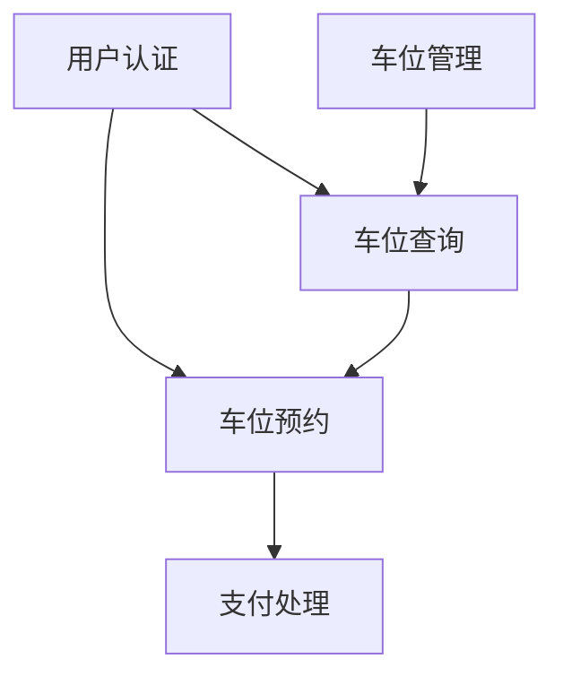
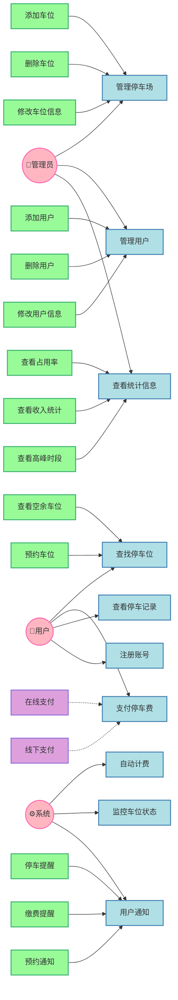
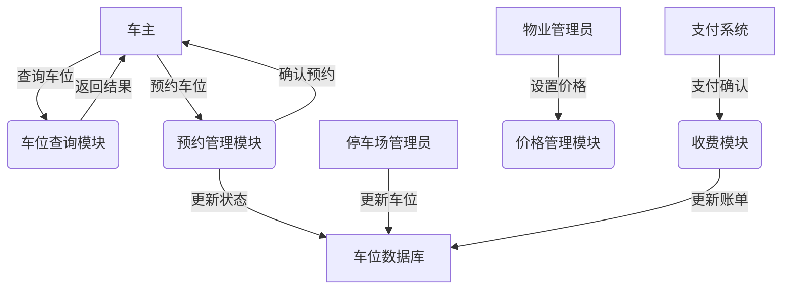

# 城市共享停车管理系统需求规格说明书

## 一、引言
### 1.1 编写目的
本文档旨在详细描述城市共享停车管理系统的需求规格说明，作为系统分析、设计和开发的依据。通过明确的需求描述，确保系统的开发符合预期的功能和性能要求。

### 1.2 项目背景
随着城市机动车保有量的快速增长，停车难问题日益突出。为提高停车资源利用效率，需要建设智能化的停车管理系统。本项目旨在通过信息化手段，实现停车资源的高效管理和共享利用。

### 1.3 参考文档
- 《停车场管理系统行业标准》
- 《移动支付接口规范》
- 《数据安全等级保护标准》

## 二、项目概述
### 2.1 项目目标
构建高效、可靠的城市级共享停车管理平台，实现停车资源的智能化管理和共享利用。通过系统的实施：

1. 提升停车资源利用率
   - 实现停车位资源的共享和复用
   - 提高车位周转率
   - 减少空置浪费

2. 优化用户停车体验
   - 提供便捷的车位查询和预约服务
   - 支持多种支付方式
   - 实现智能导航和位置服务

3. 加强停车场管理效率
   - 实现停车场智能化管理
   - 提供数据分析和决策支持
   - 降低人工管理成本

### 2.2 系统范围
1. 系统类型
   - 架构：B/S架构的Web应用系统
   - 部署：云端部署，支持分布式扩展
   - 客户端：Web网页 + 移动端APP

2. 业务领域
   - 主要领域：智慧城市 - 停车管理
   - 覆盖范围：居民小区、商业中心、公共停车场
   - 业务模式：C2C（个人车位共享）、B2C（商业停车服务）

3. 用户规模
   - 目标城市：省会级特大城市
   - 停车场数量：支持1000+停车场接入
   - 车位数量：支持10万+车位管理
   - 用户规模：日活跃用户2万+

### 2.3 用户特征
1. 系统管理员
   - 职责：负责系统运维、用户管理和数据统计
   - 权限级别：最高级别管理权限
   - 关注点：系统稳定性、安全性、可维护性

2. 停车场管理员
   - 职责：负责停车场管理、收费管理和异常处理
   - 权限级别：区域级别管理权限
   - 关注点：管理效率、收益统计、服务质量

3. 物业管理员
   - 职责：负责小区停车管理、收益管理和投诉处理
   - 权限级别：场地级别管理权限
   - 关注点：业主满意度、收益分配、投诉处理

4. 车主用户
   - 职责：遵守平台规则，按时支付费用
   - 权限级别：基本使用权限
   - 关注点：使用便利性、费用透明度、服务可靠性

## 三、项目环境
### 3.1 软件环境
1. 开发环境
   - 操作系统：Windows/Linux
   - 开发工具：IDE、版本控制工具
   - 开发语言：Java、JavaScript等

2. 运行环境
   - 服务器：Linux服务器
   - 数据库：MySQL
   - 中间件：Redis、Kafka等

### 3.2 硬件环境
1. 服务器配置
   - 应用服务器：16核CPU，32G内存
   - 数据库服务器：16核CPU，64G内存
   - 存储空间：10TB

2. 网络环境
   - 内网带宽：千兆以太网
   - 外网带宽：100Mbps以上

## 四、功能需求
### 4.1 系统功能结构
```
系统功能树：
├── 用户管理子系统
│   ├── 用户注册与认证
│   ├── 权限管理
│   └── 用户信息维护
├── 车位管理子系统
│   ├── 车位信息管理
│   ├── 车位状态监控
│   └── 统计分析功能
├── 预约服务子系统
│   ├── 在线预约处理
│   ├── 状态确认管理
│   └── 取消处理机制
└── 支付结算子系统
    ├── 费用计算模块
    ├── 在线支付处理
    └── 订单管理功能
```

### 4.2 功能描述
在本系统中，功能需求主要围绕四大子系统展开：

1. 用户管理子系统
   - 用户注册与认证：支持多种注册方式，实现实名认证，提供多因素认证机制
   - 权限管理：基于RBAC模型，实现细粒度的权限控制
   - 用户信息维护：提供个人信息管理，包括基本资料修改、车辆信息绑定等

2. 车位管理子系统
   - 车位信息管理：维护停车场和车位的基础信息，支持批量导入和实时更新
   - 车位状态监控：通过传感器和摄像头实时监测车位状态，提供异常报警
   - 统计分析功能：收集和分析使用数据，生成多维度报表

3. 预约服务子系统
   - 在线预约处理：提供多渠道预约入口，支持实时和定时预约
   - 状态确认管理：自动跟踪预约状态变更，提供提醒服务
   - 取消处理机制：支持灵活的取消策略，自动处理资源释放

4. 支付结算子系统
   - 费用计算模块：支持多种计费模式，实现阶梯价格和优惠策略
   - 在线支付处理：集成主流支付渠道，提供支付安全保障
   - 订单管理功能：统一管理订单，支持退款和发票开具

### 4.3 数据需求
1. 数据实体
   - 用户信息：包括用户ID、姓名、联系方式等。
   - 停车场信息：包括停车场ID、地理位置、类型等。
   - 车位信息：包括车位ID、状态、位置等。
   - 预约记录：包括预约ID、用户ID、车位ID、时间段等。
   - 支付记录：包括支付ID、预约ID、金额、时间等。

2. 数据关系
   - 用户与预约：一对多
   - 停车场与车位：一对多
   - 车位与预约：一对多
   - 预约与支付：一对一

## 五、非功能需求
### 5.1 性能需求
系统的性能直接影响用户体验和停车资源的利用效率，需要在实时性、准确性和业务处理方面达到严格的标准：

1. 并发用户量
   - 日活跃用户要求：
     * 常规时段：支持2万+用户同时在线
     * 高峰时段：可支持3万+用户并发访问
     * 节假日峰值：预留5万+用户并发容量
   - 峰值并发用户：
     * 查询操作：支持2000+用户同时查询
     * 预约操作：支持1000+用户同时预约
     * 支付操作：支持500+用户同时支付
   - 单停车场并发：
     * 常规车场：支持20+用户同时操作
     * 大型车场：支持50+用户同时操作
     * 商业中心：支持100+用户同时操作

2. 响应时间要求
   - 车位查询：
     * 普通查询：≤2秒
     * 复杂筛选：≤3秒
     * 地图展示：≤5秒
   - 预约操作：
     * 提交预约：≤3秒
     * 状态确认：≤2秒
     * 取消操作：≤2秒
   - 支付处理：
     * 订单生成：≤2秒
     * 支付处理：≤5秒
     * 结果通知：≤3秒

3. 业务并发量
   - 查询请求：
     * 常规时段：500次/分钟
     * 高峰时段：1500次/分钟
     * 节假日峰值：2500次/分钟
   - 预约请求：
     * 常规时段：100次/分钟
     * 高峰时段：300次/分钟
     * 节假日峰值：500次/分钟
   - 支付请求：
     * 常规时段：50次/分钟
     * 高峰时段：150次/分钟
     * 节假日峰值：250次/分钟

### 5.2 可用性需求
1. 系统运行时间
   - 年度可用率：≥99.9%
   - 计划内维护：每月≤4小时
   - 故障恢复时间：≤30分钟

2. 数据备份要求
   - 实时数据：每小时增量备份
   - 历史数据：每日全量备份
   - 备份保留：至少保留3个月

3. 容错能力
   - 输入容错：
     * 数据校验：前后端双重验证
     * 异常处理：完整的异常捕获机制
     * 防重复提交：表单级防重复提交
   - 系统容错：
     * 服务降级：核心功能优先保证
     * 负载均衡：多节点动态调度
     * 熔断机制：及时隔离故障节点

### 5.3 安全性需求
1. 身份认证
   - 用户认证：
     * 登录验证：支持多因素认证
     * 密码策略：强制密码复杂度要求
     * 登录保护：异常登录提醒
   - 权限控制：
     * 角色管理：基于RBAC模型
     * 操作审计：关键操作留痕
     * 会话管理：超时自动登出

2. 数据安全
   - 传输安全：
     * 通信加密：全程HTTPS加密
     * 数据加密：敏感信息加密存储
     * 完整性校验：关键数据签名验证
   - 存储安全：
     * 数据脱敏：敏感信息展示脱敏
     * 访问控制：严格的数据访问权限
     * 数据备份：异地多副本备份

### 5.4 可扩展性需求
1. 系统架构
   - 模块化设计：
     * 功能模块独立封装
     * 接口标准化
     * 支持模块热插拔
   - 水平扩展：
     * 支持集群部署
     * 负载均衡机制
     * 动态扩容能力
   - 服务解耦：
     * 微服务架构
     * 消息队列解耦
     * 数据分片存储

2. 接口兼容
   - 标准化接口：
     * RESTful API设计
     * 统一响应格式
     * 版本控制机制
   - 版本控制：
     * API版本号管理
     * 向下兼容原则
     * 废弃流程规范

## 六、系统接口
### 6.1 用户界面
1. 界面风格
   - 简洁现代
   - 响应式设计
   - 操作直观

2. 界面要求
   - 兼容主流浏览器
   - 支持移动端访问
   - 符合无障碍标准

### 6.2 外部接口
1. 支付接口
   - 微信支付
   - 支付宝
   - 银联支付

2. 地图服务
   - 高德地图API
   - 导航服务
   - 位置服务

## 七、其他需求
### 7.1 业务流程分析
#### 7.1.1 核心业务流程
1. 停车位管理流程


2. 车位预约流程


#### 7.1.2 关键用例分析
| 用例名称 | 主要参与者 | 前置条件 | 后置条件 |
|----------|------------|----------|-----------|
| 车位查询 | 车主用户 | 用户已登录 | 展示可用车位 |
| 车位预约 | 车主用户 | 存在空闲车位 | 预约成功并扣费 |
| 状态更新 | 管理人员 | 系统正常运行 | 车位状态已更新 |

### 7.2 需求跟踪与分析
#### 7.2.1 需求依赖分析


#### 7.2.2 需求优先级分析
| 需求ID | 功能描述 | 优先级 | MoSCoW分类 |
|--------|----------|---------|------------|
| REQ001 | 用户注册登录 | P0 | Must |
| REQ002 | 车位状态管理 | P0 | Must |
| REQ003 | 车位查询 | P0 | Must |
| REQ004 | 在线预约 | P0 | Must |
| REQ005 | 支付功能 | P1 | Should |
| REQ006 | 数据统计 | P2 | Could |

#### 7.2.3 需求变更控制
##### 7.2.3.1 变更流程
1. 变更申请
2. 影响分析
3. 评审决策
4. 变更实施
5. 验证确认

##### 7.2.3.2 变更评估维度
| 评估维度 | 评估指标 | 评估方法 |
|----------|----------|----------|
| 技术可行性 | 开发难度 | 专家评估 |
| 工期影响 | 延期风险 | 项目经理评估 |
| 成本影响 | 人力成本 | 成本分析 |
| 质量影响 | 系统稳定性 | 架构师评估 |

### 7.3 用例分析
基于系统的主要业务场景和用户需求，我们设计了如下用例分析图。该图展示了系统中的三类主要参与者（管理员、用户、系统）以及它们与各个用例之间的交互关系：

1. 参与者说明：
   - 管理员：包括系统管理员、停车场管理员和物业管理员，主要负责系统的管理和维护工作
   - 用户：即车主用户，系统的主要服务对象
   - 系统：代表自动化的系统功能，无需人工干预

2. 用例分类：
   - 管理类用例：包括停车场管理、用户管理等，主要面向管理员
   - 服务类用例：包括查找车位、支付费用等，主要面向普通用户
   - 自动化用例：包括自动计费、状态监控等，由系统自动执行

3. 关系说明：
   - include关系：表示被包含用例是基础用例的必要组成部分
   - extend关系：表示扩展用例是基础用例的可选功能



### 7.4 需求跟踪与分析
#### 7.4.1 需求依赖分析


#### 7.4.2 需求优先级分析
| 需求ID | 功能描述 | 优先级 | MoSCoW分类 |
|--------|----------|---------|------------|
| REQ001 | 用户注册登录 | P0 | Must |
| REQ002 | 车位状态管理 | P0 | Must |
| REQ003 | 车位查询 | P0 | Must |
| REQ004 | 在线预约 | P0 | Must |
| REQ005 | 支付功能 | P1 | Should |
| REQ006 | 数据统计 | P2 | Could |

#### 7.4.3 需求变更控制
##### 7.4.3.1 变更流程
1. 变更申请
2. 影响分析
3. 评审决策
4. 变更实施
5. 验证确认

##### 7.4.3.2 变更评估维度
| 评估维度 | 评估指标 | 评估方法 |
|----------|----------|----------|
| 技术可行性 | 开发难度 | 专家评估 |
| 工期影响 | 延期风险 | 项目经理评估 |
| 成本影响 | 人力成本 | 成本分析 |
| 质量影响 | 系统稳定性 | 架构师评估 |

## 八、附录
### 8.1 术语表
| 术语 | 描述 | 备注 |
|------|------|------|
| RBAC | 基于角色的访问控制 | 安全机制 |
| TLS | 传输层安全协议 | 加密通信 |
| API | 应用程序接口 | 接口规范 |

### 8.2 数据字典
基于概念模型的核心数据项：

| 数据项 | 数据类型 | 长度 | 约束 | 说明 |
|--------|----------|------|------|------|
| user_id | VARCHAR | 32 | 主键 | 用户唯一标识 |
| username | VARCHAR | 50 | 非空 | 用户姓名 |
| phone | VARCHAR | 20 | 非空,唯一 | 手机号码 |
| car_plate | VARCHAR | 10 | 非空 | 车牌号码 |
| parking_id | VARCHAR | 32 | 主键 | 停车场唯一标识 |
| type | TINYINT | 1 | 非空 | 1-居民小区,2-大学校园,3-机关大院,4-公共停车场,5-路边车位 |
| space_id | VARCHAR | 20 | 主键 | 车位唯一标识 |
| status | TINYINT | 1 | 非空 | 0-空闲,1-占用,2-预约中 |
| reservation_id | VARCHAR | 32 | 主键 | 预约唯一标识 |
| reserve_time | DATETIME | - | 非空 | 预约生效时间 |
| payment_id | VARCHAR | 32 | 主键 | 支付记录唯一标识 |
| start_time | DATETIME | - | 非空 | 计费开始时间 |
| end_time | DATETIME | - | 可空 | 计费结束时间 |
| amount | DECIMAL | 10,2 | 非空 | 支付金额 |
| location | GEOMETRY | - | 非空 | 地理坐标位置 |
| update_time | DATETIME | - | 非空 | 最后更新时间 |

## 九、系统边界
系统主要由四个核心子系统构成，每个子系统负责特定的功能域：

1. 用户管理子系统
   - 用户注册与认证：支持多种注册方式（手机号、邮箱），实现实名认证，确保用户身份真实性。提供多因素认证机制，包括密码、短信验证码和生物特征识别等方式。
   - 权限管理：基于RBAC（基于角色的访问控制）模型，实现细粒度的权限控制。支持角色的动态分配和权限的灵活配置。
   - 用户信息维护：提供个人信息管理功能，包括基本资料修改、车辆信息绑定、支付方式管理等。支持用户行为分析和使用记录查询。

2. 停车资源管理子系统
   - 车位信息管理：维护停车场和车位的基础信息，包括地理位置、车位尺寸、类型分类等。支持批量导入和实时更新功能。
   - 车位状态监控：通过传感器和摄像头实时监测车位占用状态，支持自动识别和人工干预。提供状态变更记录和异常情况报警。
   - 统计分析功能：收集和分析车位使用数据，生成使用率、周转率、收益等多维度报表。支持数据可视化和趋势分析。

3. 预约服务子系统
   - 在线预约处理：提供多渠道预约入口（APP、小程序、网页），支持实时预约和定时预约。实现智能推荐最优车位。
   - 状态确认管理：自动跟踪预约状态变更，包括待确认、已确认、使用中、已完成等。提供预约提醒和到期提醒服务。
   - 取消处理机制：支持灵活的取消策略，包括免费取消时间窗口、取消次数限制、信用分管理等。自动处理取消后的资源释放。

4. 支付结算子系统
   - 费用计算模块：支持多种计费模式（按时、按次、包月等），实现阶梯价格和优惠策略。提供费用预估功能。
   - 在线支付处理：集成主流支付渠道，支持实时支付和预付费模式。提供支付安全保障和交易记录查询。
   - 订单管理功能：统一管理预约和支付订单，支持订单状态跟踪、退款处理、发票开具等功能。提供订单统计和对账功能。

### 外部系统接口
1. 支付接口
   - 微信支付系统：
     * 支持扫码支付、APP支付、小程序支付等多种方式
     * 提供实时交易状态查询和退款接口
     * 支持交易通知和对账文件下载
   - 支付宝支付系统：
     * 集成APP支付、扫码支付、服务窗支付等功能
     * 提供预授权和自动扣款接口
     * 支持交易记录查询和退款处理
   - 银联支付系统：
     * 支持借记卡和信用卡支付
     * 提供快捷支付和分期付款功能
     * 实现支付安全加密和风控处理

2. 导航服务接口
   - 高德地图API：
     * 提供精确的地理编码和反地理编码服务
     * 支持周边停车场POI搜索
     * 实现路径规划和距离计算
   - 实时导航服务：
     * 提供语音导航和实时路况信息
     * 支持多路径方案推荐
     * 实现到达时间预估
   - 路径规划服务：
     * 支持多种出行方式的路线规划
     * 提供实时路况避堵功能
     * 实现途经点和车位位置的精确导航

3. 监控系统接口
   - 车位状态监测：
     * 通过地磁传感器实时检测车位占用状态
     * 支持视频分析识别车位状态
     * 提供状态变更实时推送
   - 车牌识别系统：
     * 实现高精度车牌识别和记录
     * 支持特殊车牌（新能源、军警等）识别
     * 提供车牌信息核验接口
   - 异常情况报警：
     * 检测超时停车和违规占用
     * 支持设备故障自动报警
     * 提供紧急情况处理机制

### 角色与权限分析
#### 角色定义
1. 系统管理员
   - 职责：
     * 系统维护：负责系统运行状态监控、性能优化、故障处理等技术运维工作
     * 用户管理：管理所有用户账号，包括创建、停用、权限分配等操作
     * 数据统计：生成系统运营报表，分析系统使用情况，提供决策支持
   - 权限级别：
     * 最高级别管理权限，可以访问和操作系统所有功能
     * 可以创建和管理其他角色账号
     * 可以查看和修改系统配置参数
   - 功能范围：
     * 系统配置管理：包括基础参数设置、接口配置、安全策略等
     * 用户权限管理：分配和调整各级用户权限
     * 系统监控管理：查看系统运行状态和性能指标
     * 数据管理：数据备份、恢复、清理等操作

2. 停车场管理员
   - 职责：
     * 车位管理：维护停车场车位信息，更新车位状态
     * 收费管理：设置收费标准，处理收费异常
     * 异常处理：处理设备故障、投诉等问题
   - 权限级别：
     * 区域级别管理权限，负责特定停车场的运营管理
     * 可以管理本停车场的所有设备和车位
     * 可以处理本区域内的用户问题
   - 功能范围：
     * 车位信息管理：维护车位基础信息和状态
     * 收费标准管理：设置和调整收费规则
     * 异常情况处理：处理投诉和故障
     * 统计报表查看：分析车位使用情况

3. 物业管理员
   - 职责：
     * 小区车位管理：负责管理和维护小区内共享车位资源
     * 收益管理：跟踪和管理车位共享收益，制定分成方案
     * 投诉处理：处理业主和用户的投诉和建议
   - 权限级别：
     * 场地级别管理权限，负责特定小区的车位共享业务
     * 可以查看和管理本小区的车位资源
     * 可以设置和调整本小区的共享规则
   - 功能范围：
     * 车位共享管理：设置共享时段和规则
     * 收益统计分析：查看收益报表和分成明细
     * 业主关系维护：处理业主反馈和需求
     * 使用情况监控：监控车位使用状态和异常

4. 车主用户
   - 职责：
     * 遵守平台使用规则，按时支付费用
     * 合理使用车位，遵守停车时限
     * 及时反馈使用过程中的问题
   - 权限级别：
     * 普通用户级别，具有基本的使用权限
     * 可以查询和预约可用车位
     * 可以进行支付和评价操作
   - 功能范围：
     * 车位查询预约：搜索并预约合适的车位
     * 支付管理：费用支付和订单管理
     * 个人中心：管理个人信息和使用记录
     * 评价反馈：对使用体验进行评价

#### 权限矩阵
| 功能模块 | 系统管理员 | 停车场管理员 | 物业管理员 | 车主用户 | 说明 |
|---------|------------|-------------|------------|---------|------|
| 系统配置 | ✓ | × | × | × | 包括系统参数设置、接口配置、安全策略等 |
| 用户管理 | ✓ | × | × | × | 用户账号管理、权限分配、角色设置 |
| 车位管理 | ✓ | ✓ | ✓ | × | 车位信息维护、状态更新、共享设置 |
| 价格设置 | ✓ | ✓ | ✓ | × | 停车费率设置、优惠策略配置 |
| 收益统计 | ✓ | ✓ | ✓ | × | 收入统计、分成核算、报表生成 |
| 车位查询 | ✓ | ✓ | ✓ | ✓ | 车位信息查询、可用状态查看 |
| 车位预约 | × | × | × | ✓ | 在线预约、取消、修改预约 |
| 支付操作 | × | × | × | ✓ | 费用支付、订单管理、发票申请 |

#### 权限管理规则
1. 权限继承原则
   - 上级角色继承下级角色的所有权限
   - 特殊权限需要单独授权
   - 权限变更需要有审批流程

2. 权限分配规则
   - 遵循最小权限原则
   - 职责相关性原则
   - 权限互斥性原则

3. 权限变更管理
   - 变更需要有明确的申请理由
   - 重要权限变更需要多级审批
   - 所有变更需要记录日志

### 数据流分析
#### 核心数据流图


#### 主要数据流向
1. 车位信息流
   - 数据来源：
     * 停车场管理员：录入和更新基础信息
     * 物业管理员：设置共享规则和时段
     * 监控系统：实时状态更新
   - 数据去向：
     * 系统数据库：持久化存储
     * 用户查询界面：展示可用车位
     * 统计分析模块：生成使用报表
   - 数据内容：
     * 基础信息：位置、编号、类型、尺寸
     * 状态信息：空闲、占用、预约、维护
     * 共享信息：共享时段、价格、限制条件
     * 使用记录：使用时长、周转率、评价

2. 预约信息流
   - 数据来源：
     * 车主用户：发起预约请求
     * 系统自动：定时预约处理
     * 管理人员：人工干预处理
   - 数据去向：
     * 预约管理模块：状态跟踪
     * 车位数据库：更新车位状态
     * 用户界面：预约结果反馈
   - 数据内容：
     * 预约信息：时间段、车位信息、用户信息
     * 状态信息：预约状态、确认状态、使用状态
     * 车辆信息：车牌号、车型、所有人信息
     * 联系方式：手机号、紧急联系人

3. 支付信息流
   - 数据来源：
     * 车主用户：发起支付请求
     * 计费模块：生成费用账单
     * 支付系统：支付结果通知
   - 数据去向：
     * 支付系统：处理支付请求
     * 收费模块：更新支付状态
     * 统计模块：收入统计分析
   - 数据内容：
     * 支付信息：金额、方式、时间
     * 订单信息：订单号、状态、明细
     * 优惠信息：优惠券、折扣规则
     * 发票信息：开具状态、发票内容

#### 用例分析图


### 非功能需求分析
#### 性能需求
1. 并发用户量
   - 日活跃用户要求：
     * 常规时段：支持2万+用户同时在线
     * 高峰时段：可支持3万+用户并发访问
     * 节假日峰值：预留5万+用户并发容量
   - 峰值并发用户：
     * 查询操作：支持2000+用户同时查询
     * 预约操作：支持1000+用户同时预约
     * 支付操作：支持500+用户同时支付
   - 单停车场并发：
     * 常规车场：支持20+用户同时操作
     * 大型车场：支持50+用户同时操作
     * 商业中心：支持100+用户同时操作

2. 响应时间要求
   - 车位查询：
     * 普通查询：≤2秒
     * 复杂筛选：≤3秒
     * 地图展示：≤5秒
   - 预约操作：
     * 提交预约：≤3秒
     * 状态确认：≤2秒
     * 取消操作：≤2秒
   - 支付处理：
     * 订单生成：≤2秒
     * 支付处理：≤5秒
     * 结果通知：≤3秒

3. 业务并发量
   - 查询请求：
     * 常规时段：500次/分钟
     * 高峰时段：1500次/分钟
     * 节假日峰值：2500次/分钟
   - 预约请求：
     * 常规时段：100次/分钟
     * 高峰时段：300次/分钟
     * 节假日峰值：500次/分钟
   - 支付请求：
     * 常规时段：50次/分钟
     * 高峰时段：150次/分钟
     * 节假日峰值：250次/分钟

#### 可用性需求
1. 系统运行时间
   - 年度可用率：≥99.9%
   - 计划内维护：每月≤4小时
   - 故障恢复时间：≤30分钟

2. 数据备份要求
   - 实时数据：每小时增量备份
   - 历史数据：每日全量备份
   - 备份保留：至少保留3个月

3. 容错能力
   - 输入容错：
     * 数据校验：前后端双重验证
     * 异常处理：完整的异常捕获机制
     * 防重复提交：表单级防重复提交
   - 系统容错：
     * 服务降级：核心功能优先保证
     * 负载均衡：多节点动态调度
     * 熔断机制：及时隔离故障节点

#### 安全性需求
1. 身份认证
   - 用户认证：
     * 登录验证：支持多因素认证
     * 密码策略：强制密码复杂度要求
     * 登录保护：异常登录提醒
   - 权限控制：
     * 角色管理：基于RBAC模型
     * 操作审计：关键操作留痕
     * 会话管理：超时自动登出

2. 数据安全
   - 传输安全：
     * 通信加密：全程HTTPS加密
     * 数据加密：敏感信息加密存储
     * 完整性校验：关键数据签名验证
   - 存储安全：
     * 数据脱敏：敏感信息展示脱敏
     * 访问控制：严格的数据访问权限
     * 数据备份：异地多副本备份

#### 可扩展性需求
1. 系统架构
   - 模块化设计：
     * 功能模块独立封装
     * 接口标准化
     * 支持模块热插拔
   - 水平扩展：
     * 支持集群部署
     * 负载均衡机制
     * 动态扩容能力
   - 服务解耦：
     * 微服务架构
     * 消息队列解耦
     * 数据分片存储

2. 接口兼容
   - 标准化接口：
     * RESTful API设计
     * 统一响应格式
     * 版本控制机制
   - 版本控制：
     * API版本号管理
     * 向下兼容原则
     * 废弃流程规范

#### 指标监控与优化
1. 性能监控
   - 实时监控：
     * 部署性能监控系统实时跟踪各项指标
     * 设置关键指标告警阈值
     * 建立性能分析报表体系
   - 优化机制：
     * 定期进行性能评估和优化
     * 针对性能瓶颈制定改进方案
     * 持续跟踪优化效果

2. 可用性保障
   - 监控手段：
     * 部署全链路监控系统
     * 建立健康检查机制
     * 实施故障自动告警
   - 应急预案：
     * 制定完整的故障处理流程
     * 定期进行故障演练
     * 持续优化恢复机制

3. 持续改进
   - 数据分析：
     * 收集和分析性能数据
     * 进行用户体验调研
     * 评估系统瓶颈
   - 优化方案：
     * 制定阶段性优化目标
     * 实施渐进式改进
     * 评估优化效果